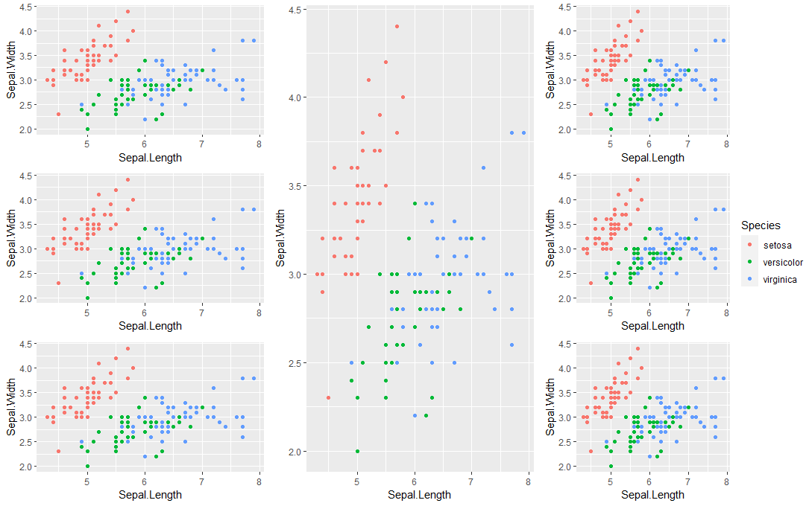

# Mixed model
https://m-clark.github.io/mixed-models-with-R/random_intercepts.html

Random intercepts model: group-specific intercepts with own unique effects.
E.g. (1 | student) the intercept 1 is allowed to vary between student to student.
The random effect is to the left of |

# Read excel files in R:

```r
# Excel: 
readxl::read_xlsx(name_of_file)

# Password protected excel:
library("excel.link")
xl.read.file(indata, password = "mypswd", write.res.password="mypswd")

```
# Read files in R

To do

# Unload library/package from R session without restarting

```r
# unloading library(officer)
detach(package:officer)
```

## Restart R-session and unload packages
RStudio: command/ctrl + shift + F10


# Save R results in Word file

```r
library(flextable) # converting dataframes to flextable objects
library(officer) # for adding data to word document, like flextables

# simplest example:
tab1 <- matrix( c(1,2,3,4), ncol=2, nrow=2)
word_export <- read_docx()
word_export <- word_export %>% body_add_flextable( as.data.frame.matrix(tab1) %>% flextable()  )
print(word_export, 'try.docx')
```


```r
# add new page:
mydoc %>% body_add_break()

```

# Check outliers in boxplots: 

```r
is_outlier <- function(x) {
  return(x < quantile(x, 0.25,na.rm = T) - 1.5 * IQR(x, na.rm = T) | x > quantile(x, 0.75, na.rm = T) + 1.5 * IQR(x,na.rm=T))
}
outlier_df <- score_diffs %>% 
  mutate( across( ends_with("_diff"), is_outlier , .names="out_{.col}" ) ) 
outlier_df %>%
  select(pid, contains("b_diff") ) %>% 
  filter(out_b_diff ==T) %>%
  arrange(randgrp, b_diff)
```

Note: outliers in `boxplot()` is computed differently. In that case,
use `boxplot.stats()$out` to see outlier values.

## Group boxplot by group

```r
boxplot(temp$num ~ temp$group)
```

# Table 1 : nice summary tables

```
library(table1) 
# or:
library(tableone)

```

with flextable:

```r
tableone2df <- function(tableone){
  rows <- nrow(tableone)
  cols <- ncol(tableone)
  rowsXcols <- rows*cols
  colnames <- colnames(tableone)
  rownames <- rownames(tableone)

  listoflists <- list()
  for (i in 1:cols){
    start <- (i*rows+1)-rows
    end <- i*rows
    listoflists[[i]] <- tableone[start:end]
  }
  dataframe <- as.data.frame(listoflists, col.names = colnames, row.names = rownames)
  return(dataframe)
}

# then do:
flextable::flextable(tableone2df(table_1)  %>% rownames_to_column("Variable"))
```

# Create contingency tables

```
table()
prop.table() # with proportions
```

## Add totals to table

```r
# 2=sum cols, 1=sum rows, otherwise it sums both
tab <- addmargins(table(df$Company,df$Marital), 2)
```

# Create a sequence of dates 

```r
full_dates <- seq(as.Date("2016-09-01"), by = "month", length.out =39)
full_dates <- tibble(date = full_dates)
full_dates <- full_dates %>% mutate(month = format(date, "%m"), year = format(date, "%Y") )

# you can merge the full dates with a dataframe that also contains year & month. na:s automatically added
merge(full_dates, df, by = c("year", "month"), all.x = TRUE)

# you can combine year & month columns into a single column as:
df %>% 
  mutate(new_d = format( make_date(year, month), "%Y-%m" ) )
```

# Use cut
`right` = indicating if the intervals should be closed on the right (and open on the left) or vice versa
`include.lowest` = indicating if an ‘x[i]’ equal to the lowest (or highest, for right = FALSE) ‘breaks’ value should be included.

```r 
cut(tmp2$Antal, breaks = c(-Inf,20,50,Inf), labels = c("\u226420", "21-50", "50-521"))
# will show ≤20    21-50  50-521

cut(0:10, breaks = c(0,  1, 4, 10, Inf), labels = c("0", "1-3", "4-9", "\u226510"), include.lowest = T,right=F )
# [1] 0   1-3 1-3 1-3 4-9 4-9 4-9 4-9 4-9 4-9 ≥10
#Levels: 0 1-3 4-9 ≥10

# <19, ≥20 :
cut(0:20, breaks = c(0,  19,  Inf),labels = c("<20", "\u226520"),include.lowest = T,right=T )
#[1] <20 <20 <20 <20 <20 <20 <20 <20 <20 <20 <20 <20 <20 <20 <20 <20 <20 <20 <20 <20 ≥20
#Levels: <20 ≥20
```

# Split dataframe into groups
Returns list of dataframes

```r
library(tidyverse) 
mtcars %>% split(.$cyl)
```


# Create Swedish map of municipalities (kommuner)

[Kommunkoder](https://www.scb.se/hitta-statistik/regional-statistik-och-kartor/regionala-indelningar/lan-och-kommuner/lan-och-kommuner-i-kodnummerordning/#Stockholms_lan)

```r
library(tidyverse)
library(sf)
library(RColorBrewer)

# Data för Sverigekarta
tmp1 <- tempfile()
download.file("http://api.thenmap.net/v2/se-7/geo/2020-08-14", destfile = tmp1)
county <- read_sf(tmp1)
county <- st_transform(x = county, crs = 3006)
county <- merge(county, antal, by.x = "id", by.y = "Kommun", all.x=T)

county$size <- cut(county$Antal, breaks = c(0, 10, 100, 1000, Inf), 
                    labels = c("1-10", "11-100", "101-1000", ">1000"))
                    
cls_size <- brewer.pal(4, "Reds")
ggplot() +
  geom_sf(data = county, aes(fill = size)) +
  theme_void() +
  scale_fill_manual("Municipality size", values = cls_size) 
```


# Statistical tests

## Calculate power in t-test

```r
# delta: difference in means
# Number of subjects needed to obtain 80% power
power.t.test(delta = 10, sd = 19, power = 0.8, sig.level = 0.05)
# calculate power from sample size:
power.t.test(delta = 10, sd = 19, n=100, sig.level = 0.05)
```
## Wilcoxon rank sum test
Also known as the Mann Whitney U test.

```r
wilcox.test(df$num ~ temp$group)
```

## t-test
Tests difference in means
```r
t.test(temp$num ~ temp$group)
```

## Correlation incl p-values and confidence interval

```r
cor.test()
```

## Fisher's exact test
For testing the null hypothesis of independence of rows and columns in a contingency table with fixed marginals.
```r
fisher.test( matrix(c(2,10,20,3),nrow=2,ncol=2)  )
# odds ratio: 0.035, p=0.00008124
```
In Python: 
```python
import scipy.stats as stats
oddsratio, pvalue = stats.fisher_exact([[2, 10], [20, 3]])
# (0.03, 8.124495626949326e-05)
```

## Cohen's Kappa Coefficient

Kappa measures the agreement between two variables, taking into account the agreement that would happen by chance.
Kappa = (O-E) / (1-E), where O = observed agreement, E = expected agreement assuming independence.


```r
library(psych) 
tab<-matrix(c(12,20,20,12),ncol=2,nrow=2)
#     [,1] [,2]
#[1,]   12   20
#[2,]   20   12
psych::cohen.kappa(tab) # -0.25
```

### Calculate binomial confidence interval

```r 
binom.test(40, 95) # num successes, num trials
```

With CI in parenthesis for.ex. (10.1-15.5%) calculated from percentage of success:
```r 
library(stringr)
calc_conf <- function(perc, n){
  test <- round(perc*n)
  res  <- binom.test(test, n)
  lower <- res$conf.int[1] %>% round(3) *100 
  upper <- res$conf.int[2] %>% round(3) *100
  lower <- format(lower, nsmall = 1)
  upper <- format(upper, nsmall = 1)
  return(str_glue("({lower}-{upper}%)"))
}
calc_conf(0.42, 95) # (32.0-52.7%)
```

### Calculate difference in binomial confidence intervals

```r
library(DescTools)
# x = number of successes in group 1 or 2, n = number of trials in group 1 or 2 
BinomDiffCI(x1=40,n1=95,x2=2,n2=47)
```

Nicely formatted CI calculated from percentage of success:

```r
library(stringr)
bindiff <- function(perc_1, n_1, perc_2, n_2){
  test1 <- round(perc_1*n_1)
  test2 <- round(perc_2*n_2) 
  
  res <- BinomDiffCI(test1,n_1,test2,n_2)
  val <- res[1] %>% round(3) *100
  lower <- res[2] %>% round(3) *100
  upper <- res[3] %>% round(3) *100
  val <- format(val, nsmall = 1)
  lower <- format(lower, nsmall = 1)
  upper <- format(upper, nsmall = 1)
  
  return(
    list(test1=test1,test2=test2, 
    ci = str_glue("{val}% ({lower}-{upper}%)")
    ))
}
bindiff(0.42,95,0.042,47) # 37.8% (24.2-48.0%)
```

### Ordinal logistic regression
Proportinal odds: effekten av de oberoende variablerna på den beroende ordinala variabeln är konstant för alla nivåer i den beroende variabeln.


<!--
```r

```
-->

# Survival analysis

### Generate survival curves

```r
library(survival) # survival curves
fit1 <- survfit(Surv( time , survival ) ~ variable, data=df)

# Survival plot:
#install.packages("survminer")
library(survminer)
ggsurvplot(fit1)
```

### Cox regression

```r
library(survival) 
fit1 <- coxph(Surv( time , survival ) ~ variable, data=df)
summary(fit1)
```


# ggplot2


### Arrange plots

```r
library(ggpubr)
ggarrange(p1, p2, p3)
# with common legend:
ggarrange(p1, p2, p3, ncol=3, common.legend = T, legend="right")
```

#### Arrange within arrange

```r
library(tidyverse)
library(ggpubr)
# with common legend
p11 <- iris %>% ggplot(aes(Sepal.Length, Sepal.Width, color=Species)) + geom_point()
# with common legend
p1 <- ggarrange(p11  ,
                p11 ,
                p11 ,
                ncol=1, nrow=3,  legend = "none"
)
p2 <- ggarrange( p11 ,  legend = "none")
p3 <- ggarrange(
  p11,
  p11 ,
  p11 , 
  ncol=1,nrow=3, common.legend = T, legend="right"
)
ggarrange(p1, p2, p3, ncol=3, common.legend = T, legend="right")
```
Generates:



### Legend


#### Legend title

```r
library(tidyverse)
p11 <- iris %>% ggplot(aes(Sepal.Length, Sepal.Width, color=Species)) + geom_point()
# change title in legend:
p11 + labs(color = "Hej") # or fill/group
# Alternatively:
p11 + scale_color_discrete("Hej")
p11 + scale_fill_discrete("Hej") # if fill=Species
p11 + scale_color_manual("Hej")  
```


#### Legend colors

```r
library(tidyverse)
library(RColorBrewer)
p11 <- iris %>% ggplot(aes(Sepal.Length, Sepal.Width, color=Species)) + geom_point()
p11_c <- ggplot(iris, aes(x=Sepal.Length, y=Petal.Length, color=Sepal.Width)) + geom_point()

# choose custom color palette 
p11 + scale_color_brewer("Hej",palette = "Reds")
# continous:
p11_c + scale_color_gradient(low = "white", high = "red")

# alternatively:
num_categories <- 3
cls_size <- brewer.pal(num_categories, "Reds") 
p11 +  scale_color_manual("Hej", values = cls_size, drop=FALSE)
# or if fill=Species, use: 
# scale_fill_manual("Hej", values = cls_size, drop=FALSE)
# scale_linetype_manual()

# choose a pre-defined color palette:
p11 + scale_color_viridis_d("Hej")
p11 + scale_color_grey()

```

### Bar plot

```r
# stat=identity: use own y-values, rather than counting the aggregate number of rows for each x (stat=count)
# position=dodge : place bars side by side instead of stacked
 geom_bar(stat="identity", position = "dodge")

# add labels above bar plot, for example percentage value
+ geom_text(aes(label= str_glue("{value*100}%") ),
                position=position_dodge(width=0.9),
            vjust=-0.25) 

```

### Plot text column in ggplot in the same order it appears in the data frame

```r
# procedure is a text column
f <- function(x) factor(x, levels = unique(x))
reshape2::melt(tmp, id.vars = "Procedure") %>%
  ggplot(aes(x=f(Procedure), y=value*100, fill=variable)) 
```

# Tidyeval
Code - a sequence of symbols/constants/calls that will return a result if evaluated. Code can be:
(i) Evaluated immediately (Standard Eval), (ii) Quoted to use later (Non-Standard Eval).

### Quote contents as a quosure
Quosure- An expression that has been saved with an environment (aka a closure).  
A quosure can be evaluated later in the stored environment to  return a predictable result.
```r
a <- 1
b <- 2
q <- rlang::quo(a+b)
# <quosure>
#expr: ^a + b
#env:  global
```
Evaluate it with `rlang::eval_tidy(q)`, returning 3.

### Quote within function
Useful when doing ggplot functions. For example with this function you can create a function like this `f(mtcars, disp, mpg )`, where disp and mpg are columns within the dataframe mtcars (included in tidyverse). 
!! uncoutes the symbol.
```r
library(tidyverse)
f <- function(df,a,b){
  a <- rlang::enquo(a)
  b <- rlang::enquo(b)
  # !! unquotes the symbol 
  df %>%
    ggplot(aes(x=!!a,y=!!b)) + 
    geom_point()
}
mtcars
f(mtcars, disp, mpg )
```
# Purr

###  map: apply function to each element of list or vector

```r
# map: apply function to each element of list of vector
mtcars %>% map(., sum) # sum each col in df
pmap_dbl(mtcars,sum) # sum of each row
by_cyl <- mtcars %>% split(.$cyl) # list of dfs
mods <- by_cyl %>% map(~ lm(mpg ~ wt, data = .)) # in each df, create linear model

```


### Nest: split dataframe into list of dataframes

```r
library(tidyverse)
n_iris <- iris %>%  group_by(Species) %>%  nest()
## A tibble: 3 x 2
## Groups:   Species [3]
#  Species    data             
#  <fct>      <list>           
#1 setosa     <tibble [50 x 4]>
#2 versicolor <tibble [50 x 4]>
#3 virginica  <tibble [50 x 4]>
```

### Join each element in nested dataframe with another dataframe

```r
join_df <- function(df_nest, df_other) {
  df_all <- inner_join(df_nest, df_other, by = c("name1" = "name2"))
  return(df_all)
}

tmp_n2 <- tmp_n %>%
  mutate(new_data = map(data, ~ join_df(., df_of_interest)))
```

### Read nested files

Consider the dataframe df:

| matrix | filePathIn  |
|--------|-------------|
| A      | my_dir/A.px |
| B      | my_dir/B.px |
| C      | my_dir/C.px |

```r
inFile_n <- df %>% group_by(matrix) %>% nest()
# läs in alla matriser:
inFile_alla <- inFile_n %>% 
  mutate( rrr = map(data, function(x) read.px(x$filePathIn) ) )
# alternatively:
#inFile_n %>% 
#  mutate( rrr = map(data, ~ read.px(.x$filePathIn)  ) )
```
where:


inFile_n:

| matrix \<chr\> | data \<list\>      |
|----------------|--------------------|
| A              | \<tibble [1 x 2]\> |
| B              | \<tibble [1 x 2]\> |
| C              | \<tibble [1 x 2]\> |


inFile_alla:

| matrix \<chr\> | data \<list\>      | rrr \<list\>             |
|----------------|--------------------|--------------------------|
| A              | \<tibble [1 x 2]\> | \<tibble [27,000 x 7]\>  |
| B              | \<tibble [1 x 2]\> | \<tibble [25,200 x 6]\>  |
| C              | \<tibble [1 x 2]\> | \<tibble [126,000 x 7]\> |


# Stringr string manipulation

See [stringr.R](stringr.R)

```r
library(tidyverse)
df <- tibble(text = c("hej01", "HEJ:;_", "158c222e9b2ba8408") )
df

# Detect matches
# ------------------------------------------------------------------------------

# detect presence of pattern match in string:
str_detect(df$text, "hej")
# can be used to filter:
df %>% filter(str_detect(text, pattern = "hej"))

# find indexes of strings
str_which(df$text, "[a-z]" )

# count number of matches in a string:
str_count(df$text, "[0-9]")

# locate position of pattern matches in string
str_locate(df$text, "hej|HEJ") # stops after first match
str_locate(df$text, "[0-9]")
str_locate_all(df$text, "[0-9]") # shows all matches

# Subset strings
# ------------------------------------------------------------------------------

# extract substrings
str_sub(df$text, 1,2) # "he" "HE" "15"

# return strings containing pattern match
str_subset(df$text, "[0-9]") 
# "hej01"             "158c222e9b2ba8408"

# return first pattern match found in each string as a vector
str_extract(df$text, "[0-9]") 
# "0" NA  "1"

# return first pattern match found in each string as a matrix
str_match(df$text, "[0-9]")
# [1,] "0" 
# [2,] NA  
# [3,] "1"

# return all pattern matches found in each string as a matrix
# returns a list of matrices
str_match_all(df$text, "[0-9]")
# [[1]]
# [,1]
# [1,] "0" 
# [2,] "1" 
# etc

# a column gets created for each () group in pattern:
str_match(df$text, "(hej|HEJ)([0-9;:_])")
# [,1]   [,2]  [,3]
# [1,] "hej0" "hej" "0" 
# [2,] "HEJ:" "HEJ" ":" 
# [3,] NA     NA    NA  

# Manage lengths
# ------------------------------------------------------------------------------

# width of strings / number of code points.
# returns numeric vector
str_length(df$text)

# pad strings to constant width
str_pad(df$text, side = "both", width = 10, pad=" ")
# "  hej01   "        "  HEJ:;_  "        "158c222e9b2ba8408"

# truncate width of strings, replacing content with ... (ellipsis)
str_trunc(df$text, 5)
# [1] "hej01" "HE..." "15..."

# trim whitespace from start and/or end of string
str_trim("hej    ")

# Mutate strings
# ------------------------------------------------------------------------------

str_sub(df$text, 1,3) # "hej" "HEJ" "158"

# replace substring by assigning:
str_sub(df$text, 1,3) <- "nej"
str_sub(df$text, 1,3)
# [1] "nej" "nej" "nej"

# replace first matched pattern in each string:
str_replace(df$text, "n", "-") 
# [1] "-ej01"             "-ej:;_"            "-ejc222e9b2ba8408"

# replace all matched patterns in each string:
str_replace_all(df$text, "[0-9]", "-") 
# [1] "nej--"             "nej:;_"            "nejc---e-b-ba----"

# lower/uppercase:
str_to_lower(df$text)
str_to_upper(df$text)

# convert string to title case i.e. capitalized first letter
str_to_title(df$text, locale = "en")
# [1] "Nej01"             "Nej:;_"            "Nejc222e9b2ba8408"

# Join and Split
# ------------------------------------------------------------------------------

# join multiple string into one
str_c(df$text[1], df$text[2])
# [1] "nej01nej:;_"

# join/collapse a vector of strings into a single string
str_c(df$text, collapse = "")
# [1] "nej01nej:;_nejc222e9b2ba8408"

# repeat strings
str_dup(df$text,2)
#[1] "nej01nej01"      "nej:;_nej:;_"   "nejc222e9b2ba8408nejc222e9b2ba8408"

# split vector of strings into matrix of substrings,
# splitting at occurences of a pattern match
str_split_fixed(df$text, "e", n=1)
# [,1]               
# [1,] "nej01"            
# [2,] "nej:;_"           
# [3,] "nejc222e9b2ba8408"

str_split_fixed(df$text, "e", n=2)
# [,1] [,2]             
# [1,] "n"  "j01"            
# [2,] "n"  "j:;_"           
# [3,] "n"  "jc222e9b2ba8408"

str_split_fixed(df$text, "e", n=3)
# [,1] [,2]    [,3]       
# [1,] "n"  "j01"   ""         
# [2,] "n"  "j:;_"  ""         
# [3,] "n"  "jc222" "9b2ba8408"

# create a string from strings and {expressions} to evaluate
test <- "bike"
str_glue("My bike is a {test} and is {str_length(test)} characters long")
# My bike is a bike and is 4 characters long

# use dataframe, list or environment to create a string from strings:
str_glue_data(mtcars, "{rownames(mtcars)} has {hp} hp")
# Mazda RX4 has 110 hp
# Mazda RX4 Wag has 110 hp
# ...

# Order strings
# ------------------------------------------------------------------------------

# return vector of indices that sorts a charcater vector
str_order(c("cykel","bröd","ö"),locale = "se" )
# [1] 2 1 3 
# i.e. bröd first, cykel second, ö last

# sort a chracter vector
str_sort(c("cykel","bröd","ö"),locale = "se" )
# [1] "bröd"  "cykel" "ö" 

# Helpers
# ------------------------------------------------------------------------------

# override encoding of string
str_conv("hej", "utf-8")

# view html rendering of first regex match in each string
str_view(df$text, "[0-9]")

# view html rendering of all regex matches in each string
str_view_all(df$text, "[0-9]")

# wrap strings to nicely formatted paragrahps:
fruit_sentence <-  str_c(fruit, collapse = " ") 
str_wrap(fruit_sentence)

# type this to show help list for special characters like \", \n, etc
?"'"

# type \\. to mean \. in regex which matches .
# type \\\\ to mean \\ in regex which matches \
# type \\( to mean \( in regex which matches (
# \\b word boundaries
# \\w any word character
# \\W any non-word characters
# \\s any whitespace 

str_split("hej hej hej", boundary("word") )
str_split("hej hej hej", boundary("sentence") )
str_split("hej hej hej", boundary("character") )

pattern <- "a.b"
strings <- c("abb", "a.b")
str_detect(strings, pattern)
str_detect(strings, fixed(pattern))
str_detect(strings, coll(pattern))
```

# Powershell
Not really part of statistics but good to know!

### grep -r in powershell

```powershell
dir C:\Users\emiwes\Documents\experiments -Recurse | Select-String -pattern "my search"
```

# Run/execute program/scripts from R using system()

```r
system("powershell ls -rec H:\\Documents\\")
```

### Search and replace multiple files in folder
Add ls -rec for subfolders and for ex. -Include *.txt for including txt files only 
```r
system("powershell (ls H:\\Documents\\multiple_tests\\*) |
       Foreach-Object{ $f=$_; (gc $f.PSPath) |
       Foreach-Object {$_ -replace '\\\"hej', 'hej' } |
       Set-Content $f.PSPath
       }
       ")
```
