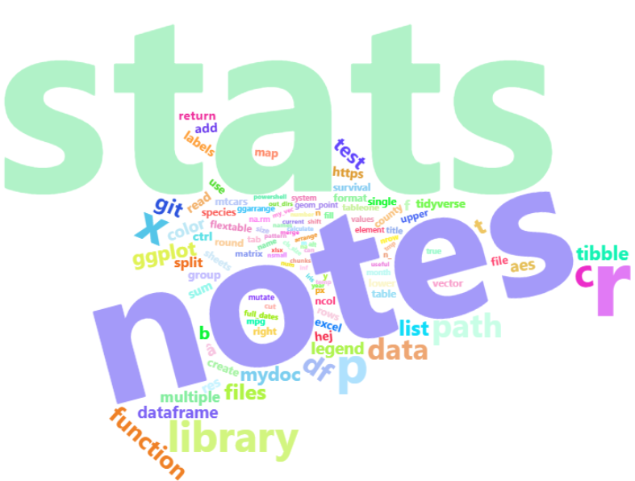

This document contains notes I make about R, data science and software
engineering in the context of statistics.

How to use this document: search for a keyword with `Ctrl` + `f` or
scroll trough.

# Updating R

The following code assumes you are using windows and can be run from
RStudio. The version of R can usually be found here
`C:\Program Files\R\R-4.2.0`. [More
info](https://cran.r-project.org/bin/windows/base/rw-FAQ.html#What_0027s-the-best-way-to-upgrade_003f "R for Windows FAQ").

``` r
install.packages("installr")
library(installr)
# Run the following 
# (you can also just type installr::updateR() and choose options interactively)
installr::updateR(browse_news = T, 
                  fast = F,
                  install_R = T, 
                  copy_packages = T, 
                  copy_site_files = T,
                  keep_old_packages = T,
                  update_packages = F, # this will be done in next step
                  start_new_R = F,
                  quit_R = F
                  )
# When the above is completed, restart R, exit R studio and reopen with a fresh session

# Reinstall the copied packages to match the latest version of R
update.packages(checkBuilt=TRUE, ask=FALSE) 

# Double check that the packages have been built with the latest version of R:
installed.packages()
```

# RStudio useful shortcuts

|                                                                            | Command                            |
|----------------------------------------------------------------------------|------------------------------------|
| Restart R-session and unload packages:                                     | `Command`/`Ctrl` + `Shift` + `F10` |
| Comment/uncomment single/multiple lines:                                   | `Ctrl`+ `Shift` + `c`              |
| Display command palette:                                                   | `Ctrl`+ `Shift` + `p`              |
| Auto-indent:                                                               | `Ctrl` + `i`                       |
| Edit multiple lines simultaneusly (increase the blinking line vertically): | `Ctrl` + `Alt` + `up / down`       |
| Duplicate current line:                                                    | `Alt` + `Shift` + `up / down`      |
| Insert assignment (`<-`):                                                  | `Alt` + `-`                        |
| Insert pipe operator (`%>%`):                                              | `Ctrl` + `Shift` + `m`             |
| Delete current line:                                                       | `Ctrl` + `d`                       |
| Multiple word selection:                                                   | `Ctrl` + `Alt` + double left click |
| Run code from beginning to line                                            | `Ctrl` + `Alt` + `b`               |
| Move/shift line up/down                                                    | `Alt` + `up / down`                |

# Probability distributions in R

| Distribution                   | cdf *F*(*x*) = *P*(*X* ≤ *x*) | Inverse cdf/quantile *F*<sup> − 1</sup>(*p*) = *x* | pdf *f*(*x*) = *P*(*X* = *x*) | Generate a random variable |
|--------------------------------|-------------------------------|----------------------------------------------------|-------------------------------|----------------------------|
| Beta                           | `pbeta`                       | `qbeta`                                            | `dbeta`                       | `rbeta`                    |
| Binomial                       | `pbinom`                      | `qbinom`                                           | `dbinom`                      | `rbinom`                   |
| Chi-Square                     | `pchisq`                      | `qchisq`                                           | `dchisq`                      | `rchisq`                   |
| Discrete Uniform               | `extraDistr::pdunif`          | `extraDistr::qdunif`                               | `extraDistr::ddunif`          | `extraDistr::rdunif`       |
| Exponential                    | `pexp`                        | `qexp`                                             | `dexp`                        | `rexp`                     |
| F                              | `pf`                          | `qf`                                               | `df`                          | `rf`                       |
| Gamma                          | `pgamma`                      | `qgamma`                                           | `dgamma`                      | `rgamma`                   |
| Geometric                      | `pgeom`                       | `qgeom`                                            | `dgeom`                       | `rgeom`                    |
| Logistic                       | `plogis`                      | `qlogis`                                           | `dlogis`                      | `rlogis`                   |
| Log Normal                     | `plnorm`                      | `plnorm`                                           | `dlnorm`                      | `rlnorm`                   |
| Negative Binomial              | `pnbinom`                     | `qnbinom`                                          | `dnbinom`                     | `rnbinom`                  |
| Normal                         | `pnorm`                       | `qnorm`                                            | `dnorm`                       | `rnorm`                    |
| Poisson                        | `ppois`                       | `qpois`                                            | `dpois`                       | `rpois`                    |
| Student t                      | `pt`                          | `qt`                                               | `dt`                          | `rt`                       |
| Studentized Range              | `ptukey`                      | `qtukey`                                           | \-                            | \-                         |
| Uniform                        | `punif`                       | `qunif`                                            | `dunif`                       | `runif`                    |
| Weibull                        | `pweibull`                    | `qweibull`                                         | `dweibull`                    | `rweibull`                 |
| Wilcoxon Rank Sum Statistic    | `pwilcox`                     | `qwilcox`                                          | `dwilcox`                     | `rwilcox`                  |
| Wilcoxon Signed Rank Statistic | `psignrank`                   | `qsignrank`                                        | `dsignrank`                   | `rsignrank`                |

For more distributions not included in base R, see the package
`extraDistr` .

## The Normal Distribution

``` r
library(tidyverse)
library(patchwork)
options(scipen = 999)

mu <- 50
sd <- 5
n <- 1000
set.seed(10)
df <- tibble(
  x = seq(1, 100, length.out = n),
  p = seq(0, 1, length.out = n),
  pdf = dnorm(x, mean = mu, sd = sd), # f(x) = P(X = x)
  cdf = pnorm(x, mean = mu, sd = sd), # F(x) = P(X <= x)
  q = qnorm(p, mean = mu, sd = sd), # F^{-1}(p) = x
  X = rnorm(n, mean = mu, sd = sd) # generate a random variable
)

p_pdf <- df %>%
  ggplot(aes(x = x, y = pdf)) +
  geom_point(size = 0.5) +
  theme_light() +
  labs(
    title = "The pdf (dnorm): P(X = x)",
    subtitle = str_glue("n = {nrow(df)}, mu = {mu}, sd = {sd}")
  )
p_cdf <- df %>%
  ggplot(aes(x = x, y = cdf)) +
  geom_point(size = 0.5) +
  theme_light() +
  labs(
    title = "The cdf (pnorm): F(x) = P(X <= x)",
    subtitle = str_glue("n = {nrow(df)}, mu = {mu}, sd = {sd}")
  )
p_q <- df %>%
  ggplot(aes(x = x, y = q)) +
  geom_point(size = 0.5) +
  theme_light() +
  labs(
    title = "The quantile / inverse cdf (qnorm)",
    subtitle = str_glue("n = {nrow(df)}, mu = {mu}, sd = {sd}")
  )
p_X <- df %>%
  ggplot(aes(x = X)) +
  geom_density() +
  theme_light() +
  labs(
    title = "Sample generated from X ~ N(50, 5)",
    subtitle = str_glue("n = {nrow(df)}, mu = {mu}, sd = {sd}")
  )

(p_cdf + p_q )/
 ( p_pdf + p_X)
```

<!-- -->

### Relationships between cdf and inverse cdf, quantiles and sample quantiles

The cdf and the inverse cdf are related by

*p* = *F*(*x*), 0 ≤ *p* ≤ 1

*x* = *F*<sup> − 1</sup>(*p*)

I.e. given a number (probability) between 0 and 1, return the p-th
quantile, i.e. the x-value on the plot. Consider also the difference
between the ‘theoretical’ quantile of the population (q) compared to the
observed sample quantile (qs).

``` r
options(scipen = 999)

plotnn <- function(n, mu, sd) {
  set.seed(10)
  X <- rnorm(n, mu, sd) # Generate random variable
  p <- 0.5 # Let the probability be 50% (the 50th percentile)
  q <- qnorm(p, mu, sd) # inverse cdf, theoretical quantile
  cdf <- pnorm(q, mu, sd) # cdf should be equal to p
  
  xbar <- mean(X) # sample mean
  xmedian <- median(X) # sample median
  sd(X)
  q_sample <- qnorm(p, xbar, sd(X)) %>% round(3)
  0.5 == pnorm(q_sample, xbar, sd(X)) # TRUE
  
  
  plot1 <- X %>%
    enframe() %>%
    ggplot(aes(x = value)) +
    geom_density(fill = "gray") +
    theme_minimal()+
    theme(legend.position="top")
  
  
  # extract x,y values from plot in order to shade the area
  d <- ggplot_build(plot1)$data[[1]]
  d <- d %>% mutate(color = case_when(
    x <= q & x > q_sample~ "P(X <= q)",
    x <= q_sample ~ "P(X <= qs)"
  ))
  
  plot1 +
    geom_area(data = subset(d, x <= q), aes(
      x = x, y = y,
      fill = factor(color)
    )) +
    annotate("text", x = q + 1, y = 0, label = str_glue("q = {q}")) +
    annotate("text", x = q - 1, y = 0 + 0.005, label = str_glue("q_sample = {q_sample}")) +
    geom_vline(xintercept = q, linetype = "dashed") +
    geom_vline(xintercept = q_sample, linetype = "dotted") + 
    scale_color_discrete("cdf:") +
    labs(
      title = "Relationship between cdf and inverse cdf (the quantile q)",
      subtitle = str_glue("X ~ N({mu}, {sd}), n = {n}. xbar = {round(xbar,4)}, median = {round(xmedian,4)}"),
      x = "x",
      fill = "cdf"
    ) +
    scale_fill_manual(breaks = c("P(X <= q)", "P(X <= qs)"),
                       values = c("#FC4E07","#00AFBB"))
}

mu <- 50
sd <- 5

plotnn(10, mu, sd)
```

<!-- -->

``` r
plotnn(100, mu, sd)
```

<!-- -->

``` r
plotnn(1000, mu, sd)
```

<!-- -->

``` r
plotnn(100000, mu, sd)
```

<!-- -->

Here is a QQ-plot to illustrate the observed quantiles (y-axis) vs the
theoretical quantiles (x-axis). This can be used to assess normality.
Note that the plot looks the same even if the values are z-transformed
or not (verify it yourself if you like by changing
`ggplot(aes(x = qq, y = x))` to `ggplot(aes(x = qq, y = x_scaled))`).

``` r
mu <- 50
sd <- 5

plotqq <- function(n, mu, sd) {
  set.seed(10)
  
  X <- rnorm(n, mu, sd)
  d <- X %>% 
    enframe(name = NULL, value = "x") %>% 
    mutate(across(x, scale, .names = "{.col}_scaled")) %>% # z-transform to mean zero and unit variance
    arrange(x) %>% 
    mutate(j = 1:length(X),
           prob_level = (j-0.5)/length(X), # 0.5 is the 'continuity' correction
           qq = qnorm(prob_level) # standard normal quantile,
    )
  
  d %>% 
    ggplot(aes(x = qq, y = x)) +
    geom_point() +
    geom_smooth(method = "lm", formula = y ~ x, se = FALSE) +
    labs(y = "Observed quantiles",
         x = "Theoretical quantiles",
         subtitle = str_glue("n = {n}, mu = {mu}, sd = {sd}")) +
    theme_light() 
}

p1 <- plotqq(10,mu,sd)
p2 <- plotqq(100,mu,sd)
p3 <- plotqq(1000,mu,sd)
p4 <- plotqq(100000,mu,sd)

(p1+p2) /
  (p3+p4)
```

<!-- -->

## The difference between percentile, quantile and quartile

The table below shows a set of possible values (domains) for the
quantile(x) and percentile(x) functions, while the quartile is always
between 0-4.

| Quartile | Quantile | Percentile  |
|----------|----------|-------------|
| 0        | 0        | 0           |
| 1        | 0.25     | 25          |
| 2        | 0.5      | 50 (median) |
| 3        | 0.75     | 75          |
| 4        | 1        | 100         |

This does not say that a quantile varies between 0 and 1, and percentile
between 0 and 100. Quantiles can go from anything to anything.
[Link](https://stats.stackexchange.com/questions/156778/percentile-vs-quantile-vs-quartile "Percentile vs quantile vs quartile")

Also note that for samples from the normal distribution, the median may
not equal the sample quantile but they should not be far apart.

# Create/write/load/manipulate excel files in R

## Load specific excel sheet and write to it without overwriting other sheets

Note: for this to work, the file obviously needs to exist beforehand. If
needed, create an empty workbook beforehand:

``` r
wb <- createWorkbook(title = str_glue("Månadsuppdatering {upp_datum}"))
addWorksheet(wb, "Session_info")
addWorksheet(wb, "Log")
saveWorkbook(wb, file = path_to_file, overwrite = TRUE)
```

Now if we want to update the ‘Log’-sheet only and not overwrite anything
else:

``` r
library(openxlsx)
library(tidyverse) # (optional, for using tibble etc)
wb <- openxlsx::loadWorkbook(path_to_file)
df <- openxlsx::readWorkbook(wb, sheet = "Log")
df <- as_tibble(df)

# * do stuff to df*
# write data to the same sheet
openxlsx::writeData(wb = wb, sheet = "Log", x = df)
# save it:
openxlsx::saveWorkbook(wb, path_to_file, overwrite = TRUE)
```

This is the absolutely best method if you want to add more sheets as
time goes and gives the most flexibility. It also preserves the original
formatting of the file that is loaded and allows you to add any styling
you want at any time.

## Read excel files in R

If you’re just interested in reading the excel data without manipulating
it too much (when saving it), these are some of the simplest options.

``` r
# Read xlsx/xls:
readxl::read_xlsx(name_of_file) 
readxl::read_xls(name_of_file) # or readxl::read_excel(name_of_file) for guessing xls or xlsx
# Read xlsx:
openxlsx::read.xlsx(name_of_file) # only for xlsx

# The following library is the best for ensuring the encoding is correct. 
# Especially when the columns contain messy data, maybe there is is a mix of , or . in a number column. 
# This function will ensure it is read exactly as it is written in the excel-file. Requires name or index of sheet.
library(xlsx)
xlsx::read.xlsx(name_of_file, sheetIndex = 1, encoding = "UTF-8")

# Custom function useful when used for reading multiple excel files in purrr::map() 
read_my_excel <- function(x) {
  print(str_glue("Reading {x}"))
  # try(openxlsx::read.xlsx(x, sep.names = " ") %>% 
  #       as_tibble())
  try(xlsx::read.xlsx(x, sheetIndex = 1, encoding = "UTF-8") %>% 
        as_tibble())
}
# something like this: (saved as df)
excel_df <- list.files(dir_where_excel_files_are, full.names = T) %>% 
  set_names(~basename(.) %>% str_remove(".xlsx")) %>% 
  enframe(name = "filename") %>% 
  mutate(excel_in = map(value, read_my_excel))


# Password protected excel:
library("excel.link")
xl.read.file(indata, password = "mypswd", write.res.password="mypswd")

# Write excel files:
library(openxlsx)
write.xlsx(df, file = "Output/myfile.xlsx")
```

## Write multiple data frames as sheets in single excel file

Option 1 (simplest):

``` r
# Write multiple data frames as sheets in single excel file:
list_of_datasets <- list("Sheet name 1" = df1, 
                         "Sheet name 2" = df2,
                         "Sheet name 3" = df3)
openxlsx::write.xlsx(list_of_datasets, file = "Output/myfile.xlsx")    
```

Option 2 (more customization):

``` r
library(openxlsx)
library(tidyverse)
 
# Split dataframe into list of tables
dat <- split(mtcars, mtcars$cyl)
 
wb <- createWorkbook()
 
# loop trough list of splitted tables, adding worksheets and styles:
map2(.x = dat, .y = names(dat),
     .f = function(data, name) {
       addWorksheet(wb, name)
       freezePane(wb, name, firstActiveRow = 2)
       writeData(wb, name, data, withFilter = TRUE)
     })
 
saveWorkbook(wb, file = "Output/myfile.xlsx", overwrite = TRUE)
```

If you don’t need to apply any styling for each sheet you can just do:

``` r
dat <- split(mtcars, mtcars$cyl)
openxlsx::write.xlsx(dat, file = "Output/myfile.xlsx")   
```

## Add comments to cells

``` r
comments <- c("comment 1",
"comment 2",
"comment 3")
# add comments to columns:
map(1:length(comments),
      ~ writeComment(wb, 1, col = .x, row = 1, 
                     comment = createComment(comment = comments[.x], visible = F)))

# add comments to rows:
map(1:length(comments),
      ~ writeComment(wb, 1, col = 1, row = .x, 
                     comment = createComment(comment = comments[.x], visible = F)))
```

## Openxlsx template

``` r
# header style
hs1 <- openxlsx::createStyle(
  fontColour = "#ffffff", fgFill = "#4F80BD",
  halign = "center", valign = "center", textDecoration = "bold",
  border = "TopBottomLeftRight", fontSize = 14
)

curr_sheetname <- str_glue("<insert_sheetname_here>")
wb <- openxlsx::createWorkbook()
openxlsx::addWorksheet(wb, curr_sheetname)

# If you want to change base font: 
openxlsx::modifyBaseFont(wb, fontSize = 12, fontColour = "black", fontName = "Arial Narrow")

# Write data
openxlsx::writeData(wb, sheet = curr_sheetname, data, withFilter = T, headerStyle = hs1)
openxlsx::freezePane(wb, sheet = curr_sheetname, firstRow = T)
openxlsx::setColWidths(wb, 1, cols = 1:ncol(data), widths = "auto")

# Optional styling
# Add bgcolor based on cell values. Based on min/max when rule=NULL
conditionalFormatting(wb, 
                      curr_sheetname,
                      cols = ncol(data)-3, 
                      rows = 2:(nrow(data)+1),
                      style = c("lightblue", "darkred"),
                      rule = NULL,
                      type = "colourScale"
)

# Change format of columns
openxlsx::addStyle(wb, sheet = curr_sheetname, createStyle(numFmt = "NUMBER"), rows = 2:nrow(tmp), cols = 1)
# map(cols_to_format,
#         ~openxlsx::addStyle(wb, sheet = curr_enkät, createStyle(numFmt = "NUMBER"), rows = 2:nrow(tmp), cols = .x))

openxlsx::saveWorkbook(wb, file = str_glue("Output/insert_name.xlsx"), overwrite = T)
```

## Openxlsx write one table after another on the same sheet

``` r
counter <- 1
for (i in seq_along(x)) {
  startindex <- counter
  tmp <- x[[i]]
  n <- nrow(tmp)+1 # antal rader + en rad för kolumnen
  title <- str_remove(names(x[i]), "X") # enkätfrågan + ta bort X
  
  openxlsx::writeData(wb, curr_enkät, title, startRow = startindex, startCol = 1)
  openxlsx::addStyle(wb, curr_enkät, style, rows = startindex, cols = 1)
  openxlsx::writeDataTable(wb, curr_enkät, tmp, startRow = startindex+1, startCol = 1)
  
  counter <- counter + n + 1 + 1
  
  rm(tmp)
  rm(title)
  rm(startindex)
  rm(n)
}
```

## Read dates

When importing dates from Excel into R, dates are represented as days
since 1899-12-30. Usually this is done automatically, but in some cases
there may be text in the columns, then you can use this method (text
-&gt; NA):

``` r
as.Date(44301, origin = "1899-12-30")
```

All versions of Excel for Windows calculate dates based on the 1900 date
system. However for older versions of Mac, the 1904 date system is
needed. So it is a good idea to double check with the data so that your
imported dates look as expected.
[Link](https://support.microsoft.com/en-us/office/date-systems-in-excel-e7fe7167-48a9-4b96-bb53-5612a800b487 "Date systems in excel")

If the column contains both dates and text for some reason, and you want
to keep the text, use this function:

``` r
# Function for converting excel-dates in 1900-date system to R-dates, while keeping texts as they are
# if the column has a mix of texts and dates
convertd <- function(x) {
  x <- ifelse(str_detect(x, "^[0-9]+$"), as.character(as.Date(as.numeric(x), origin = "1899-12-30")), x)
  return(x)
}
convertd(c(22,"aa"))
# [1] "1900-01-21" "aa" 
```

## Add a plot to an excel sheet

``` r
library(tidyverse)
library(openxlsx)
wb <- createWorkbook()
addWorksheet(wb, "Sheet 1", gridLines = FALSE)
p <- iris %>% 
    ggplot(aes(x=Sepal.Length, y = Sepal.Width)) +
    geom_point()
print(p)
insertPlot(wb, sheet = "Sheet 1", width = 20, height = 20, fileType = "png", units = "cm")
## Save workbook
saveWorkbook(wb, "insertPlotExample2.xlsx", overwrite = TRUE)
```

## Add multiple plots into single excel sheet

``` r
library(tidyverse)
library(openxlsx)
wb <- createWorkbook()
addWorksheet(wb, "Sheet 1", gridLines = FALSE)

ccc <- iris$Species %>%  unique 

startrow <- 1
for (i in ccc) {
  #print(i)
  p <- iris %>% 
    filter(Species == i) %>% 
    ggplot(aes(x=Sepal.Length, y = Sepal.Width)) +
    geom_point()
    
  print(p)
  insertPlot(wb, sheet = "Sheet 1", startRow = startrow, width = 20, height = 20, fileType = "png", units = "cm")
  startrow <- startrow + 45
}

getwd()
## Save workbook
saveWorkbook(wb, "insertPlotExample2.xlsx", overwrite = TRUE)
```

## Read multiple excel sheets from single excel file into a single data frame

Credits to
<https://dominicroye.github.io/en/2019/import-excel-sheets-with-r/>

``` r
in_path <- "path/to/excelfile.xlsx"

# read multiple sheets and join them into single dataframe:
df <- in_path %>%
  readxl::excel_sheets() %>% # vector containing name of sheets
  set_names() %>% # sets the names of vector with names of sheets
  # map_df: a list of tables joined with bind_rows into single dataframe:
  purrr::map_df(readxl::read_excel,
    path = in_path,
    .id = "level" # creates column called level with names of the sheets
  )
```

## Read multiple excel sheets for multiple excel files into a single data frame

``` r
read_multiple_excel_sheets <- function(path, idname = "sheet") {
  print(str_glue("Reading {path} with id = {idname} for each sheet"))
  path %>%
    readxl::excel_sheets() %>% 
    set_names() %>% 
  map_df(read_excel, path = path, .id = idname)
}

df <- dir(pattern = "xlsx") %>% 
           map_df(read_multiple_excel,
                  .id = "level")
```

# Excel

## Useful excel formulas

### Split number+text pattern

For example, D6 is ‘108 Denmark’ becomes ‘108’:

``` excel
=LEFT(D6; SUM(LEN(D6) - LEN(SUBSTITUTE(D6; {"0";"1";"2";"3";"4";"5";"6";"7";"8";"9"}; ""))))
```

Extract the text part, where E5 is ‘108 Denmark’ and C5 is ‘108’:

``` excel
=RIGHT(E5;LEN(E5)-LEN(C5))
```

Note: add -1 to exclude the whitespace.

### Split text+number pattern

Extract the number part, where D6 is ‘Denmark 108’:

``` excel
=RIGHT(D6; SUM(LEN(D6) - LEN(SUBSTITUTE(D6; {"0";"1";"2";"3";"4";"5";"6";"7";"8";"9"}; ""))))
```

Extract the text, where E5 is ‘Denmark 108’ and C5 is ‘108’:

``` excel
=LEFT(E5,LEN(E5)-LEN(C5))
```

Note: add -1 to exclude the whitespace.

# Read CSV files in R

Read multiple csv files in directory using summarise.

See <https://www.tidyverse.org/blog/2020/03/dplyr-1-0-0-summarise/>

``` r
library(tidyverse)
# reading all csv files in current directory:
tibble(path = dir(pattern = "\\.csv$")) %>% 
  rowwise(path) %>% 
  summarise(read_csv(path))
```

Or read from any directory:

``` r
path <- "C:/Users/my_usrname/output/csv"

df <- list.files(path, full.names = T, include.dirs = F) %>% 
  set_names(basename(.)) %>% 
  map_df(.x = ., 
         .f = read_delim,
         delim = ";", 
         col_types = cols(.default = "c"),
         .id = "matris")
```

If the csv files has multiple columns with same names, try to merge them
together. For example, all columns starting with ‘SOURCE’:

``` r
# get colnames
source_cols <- res[str_detect(names(res), "SOURCE.*")] %>% names()
x <- res[source_cols]
res$SOURCE <- do.call(paste, c(x, sep = " # ")) # paste all cols together, separate with # in this case 
res <- res %>% select(-setdiff(source_cols, "SOURCE")) # remove all other columns 
```

# read\_delim : read any character delimited file

This is useful, especially since csv files may in fact be separated with
semicolon (;) and not comma, which may be due to the locale and OS used
when the csv file was saved. For example, in Swedish, comma (,) is used
as a decimal separator.

``` r
res <- list.files(path = indir, pattern = "*.csv", full.names = TRUE) %>%
  map_df(read_delim,
         delim = ";", 
         col_types = cols(.default = "c"), # read all cols as chr
         locale = locale(encoding = "iso-8859-15"), # specify locale if needed, in this case  ISO Latin 9 (western europe)
         id="filename")
```

# Data wrangling

## Split delimited strings in a column and insert as new rows

Consider

| A   | B                   |
|-----|---------------------|
| 1   | apple, banana, pear |
| 2   | watermelon, apple   |

``` r
library(tidyverse)
df <- tribble(
  ~A, ~B,
  1, c("apple, banana, pear"),
  2, c("watermelon, apple")
)
df %>% 
  separate_rows(B)
```

## Self join / cross-join

Table band\_members:

| name | band    |
|------|---------|
| Mick | Stones  |
| John | Beatles |
| Paul | Beatles |

To perform a self-join in R, i.e. a Cartesian product of all
combinations of a table, supply `by = character()`

``` r
library(tidyverse)
band_members %>% 
  left_join(band_members, by = character())
```

This is basically the R/dplyr equivalent of a SQL self-join:

``` sql
select * from band_members b1, band_members b2
```

## Other joins

Table band instruments:

| name  | plays  |
|-------|--------|
| John  | guitar |
| Paul  | bass   |
| Keith | guitar |

``` r
band_members %>% inner_join(band_instruments)
band_members %>% left_join(band_instruments)
band_members %>% right_join(band_instruments)
band_members %>% full_join(band_instruments)
```

## Complete missing values in a column in df given a reference data frame (for long format)

Turn implicit missing values into explicit missing values. The following
function works for data frames in long format where there is a ‘value’
column. If you supply a reference data frame, this function detects
which values in the supplied column are missing and adds them with
values as NA.

``` r
library(tidyverse)
# Function for completing missing values for a column, given a reference df
complete_missing <- function(.x, .reference_df, .colname) {

  ax <- deparse(substitute(.colname)) # convert .colname to string
  missingl <- setdiff(.reference_df[[ax]], .x[[ax]]) # missing levels

  a <- rlang::enquo(.colname) #
  .x %>%
    mutate(!!a := fct_expand(!!a, missingl)) %>%
    complete(!!! syms(setdiff(names(.reference_df), "value")))

}
```

Or if you want to complete a column with a value you specify yourself:

``` r
library(tidyverse)
complete_col <- function(.x, .colname, .levels) {
  a <- rlang::enquo(.colname)
  .x %>%
    mutate(!!a := fct_expand(!!a, .levels)) %>%
    complete(!!! syms(setdiff(names(.x), "value")))
}
```

Example:

``` r
x <- tribble(~Sepal.Length, ~Sepal.Width, ~Petal.Length, ~Petal.Width,    ~Species,
        1, 2, 3, 4, "setosa"
        ) 
# Convert to long formats:
x_long <- x %>% 
  pivot_longer(-Species)
iris_long <- iris %>% 
  pivot_longer(-Species)

x_long

x_long %>% 
  complete_missing(iris_long, Species)

# Is equivalent to:
# x_long %>% 
#     mutate(Species = fct_expand(Species, c("versicolor", "virginica"))) %>%
#     complete(!!! syms(setdiff(names(iris_long), "value")))
```

# System handling in R

## Remove all files and subdirectories under path/\* (without deleting path/)

``` r
unlink("path/*", recursive = TRUE)
unlink("path/*") # deletes files only, no directories
```

## Remove all files and subdirectories for multiple paths

``` r
# set pattern = ".*out.*" to target specific directories named out
out_dirs <- list.files(str_glue("C:/path1/path2"), full.names = T, recursive = T, pattern = ".*out.*", include.dirs = T)
out_dirs <- str_c(out_dirs, "/*")
# out_dirs contains: "C:/path1/path2/ax/out/*" "C:/path1/path2/dk/out/*" "C:/path1/path2/EA/out/*" "C:/path1/path2/EU/out/*" ...
unlink(out_dirs, recursive = T) # removes files and dirs under "C:/path1/path2/{ax,dk,EA,EU,...}/out/*"
```

## Extract filenames or directory names from a path

``` r
basename("C:/px/hej.txt")
# hej.txt
dirname("C:/px/hej.txt")
# "C:/px"
```

# Unload library/package from R session without restarting

``` r
# unloading library(officer)
detach(package:officer)
```

# Save R results in Word file

``` r
library(flextable) # converting dataframes to flextable objects
library(officer) # for adding data to word document, like flextables

# simplest example:
tab1 <- matrix( c(1,2,3,4), ncol=2, nrow=2)
word_export <- read_docx()
word_export <- word_export %>% body_add_flextable( as.data.frame.matrix(tab1) %>% flextable()  )
print(word_export, 'try.docx')
```

``` r
# add new page:
mydoc %>% body_add_break()
```

Function for adding R table to word document:

``` r
myft <- function(mydoc, tab, title) {
  res <- body_add_par(mydoc, "")
  res <- body_add_par(mydoc, title, style = "Tabellrubrik_")
  res <- body_add_flextable(mydoc, flextable(tab %>% as.data.frame.matrix() %>% rownames_to_column(" ")) %>% autofit(), align = "left") 
  return(res)
}
mydoc <- myft(mydoc, tt0, "Table 1. xxx")
```

Template:

``` r
library(flextable)
library(officer)

setwd("<set working dir>")
getwd()

inmall <- "word_template.docx"
utmall <- "out_file.docx"

# RAPPORT: IMPORT --------------------------------------------------------------
mydoc <- read_docx(inmall)

# RAPPORT: TITLE PAGE ----------------------------------------------------------
mydoc <- body_replace_all_text(mydoc, "TITLE", "My title page", only_at_cursor = F)
mydoc <- body_replace_all_text(mydoc, "DATE", as.character(Sys.Date()), only_at_cursor = F)

# RAPPORT: SECTION 1 -----------------------------------------------------------
mydoc <- body_add_par(mydoc, "Descriptive statistics", style = "heading 1", pos = "before")

# RAPPORT: EXPORT --------------------------------------------------------------
print(mydoc, utmall)
shell.exec(utmall)
```

# For-loops

Never use `for (i in 1:lenght(n))` because it will fail if `length(n)`
is 0, i.e. it will evaluate to `1 0`.

Use `seq_along` or `seq_len` instead.

## Preallocate the output container

For faster looping.

``` r
out <- vector("list", length(n))
for (i in seq_len(n)) {
out[[i]] <- 1 + i
}
```

# PX

## Retrieve data from PXWeb

After selecting variables for a table, you can choose to retrieve the
data in some of the following ways.

### Pxweb in R

TODO

### POST request with json query

Note: you can also specify “format”: “json” in the query to get the data
directly as json.

``` r
library(httr)
url <- "https://pxweb.nordicstatistics.org:443/api/v1/en/Nordic Statistics/Geography and climate/Land use/DENS01.px"
url <- URLencode(url) # convert whitespace to ascii %20

query <- '{
  "query": [
    {
      "code": "time",
      "selection": {
        "filter": "item",
        "values": [
          "2016",
          "2017",
          "2018",
          "2019"
        ]
      }
    }
  ],
  "response": {
    "format": "px"
  }
}'

r <- POST(url, body=query)
px <- content(r, type="text", encoding = "Windows-1252")
px
# Save as px file:
fileConn <- file("testpx.px")
writeLines(px, fileConn)
close(fileConn)
```

### Tab delimited

Save query -&gt; Update the query with a fixed starting time point and
the new time periods -&gt; Tab delimited with heading.

This may generate something like this:
`https://pxweb.nhwstat.org:443/Prod/sq/0978ea50-2b97-4a48-bc58-d4a71806336e`.

To see how it was selected, add `?select`:
`https://pxweb.nhwstat.org:443/Prod/sq/0978ea50-2b97-4a48-bc58-d4a71806336e?select`.

To download it, add `.relational_table`:
`https://pxweb.nhwstat.org:443/Prod/sq/0978ea50-2b97-4a48-bc58-d4a71806336e.relational_table`

``` r
as_tibble(read_delim(
  "https://pxweb.nhwstat.org:443/Prod/sq/0978ea50-2b97-4a48-bc58-d4a71806336e.relational_table",
  locale = locale(encoding = "latin1"),
  delim = "\t" ) )
```

## Read a px-file in R

``` r
library(pxR)
px_in <- read.px("abcd10.px",  encoding='iso-8859-15')
```

## Write/export a px-file

``` r
library(pxR)
write.px(
  px_in,
  "abcd10_new.px",
  fileEncoding = "iso-8859-15"
)
```

## Pxweb

``` r
library(pxweb)
pxweb::pxweb_interactive() # interactively browse statistical databases and download px-files via API queries
```

# Retrieve data from Polisen open API

Returns a tibble of useful information from Swedish Police reports given
location, date or event. More info here about what you can do:
<https://polisen.se/om-polisen/om-webbplatsen/oppna-data/api-over-polisens-handelser/>

``` r
library(httr)
library(tidyverse)
library(lubridate)
library(jsonlite)

get_polisen <- function(.date = NULL, .location=NULL, .events = NULL, .preprocess = T) {
  base_url <- "https://polisen.se/api/events?"
  url <- base_url
  if (!is.null(.events)) {
    events <- str_c(.events, collapse = ";")
    url <- str_c(base_url, "type=", events)
  }
  if (!is.null(.date)) {
    url <- str_c(url, "&DateTime=", .date)
  }
  if (!is.null(.location)) {
    locations <- str_c(.location, collapse = ";")
    url <- str_c(url, "&locationname=", locations)
  }

  resp <- httr::GET(as.character(url))
  
  if (httr::http_status(resp)$category != "Success") {
    print(resp)
    stop("Http status not success")
  }
  
  df <- resp %>%
    content(as = "text") %>%
    jsonlite::fromJSON() %>%
    as_tibble()
  
  if (.preprocess & nrow(df) != 0) {
    df <- df %>% 
      mutate(datetime = lubridate::as_datetime(datetime, tz = "Europe/Stockholm"),
             url = str_glue("https://polisen.se{url}"),
             summary2 = str_glue("{summary}\n<a href=\"{url}\">Mer info</a>")
      )
    # separate coordinates into two columns, rename duplicate column name
    df$location <- df$location %>% 
      as_tibble() %>% 
      separate(gps, c("lat", "lng"), sep = ",", convert = T) %>% 
      dplyr::rename(location_name = name) %>% 
      # add some noise to coordinates, since all coordinates for a given location are the same.
      # otherwise the points will overlap on the map.
      # the coordinates only show the coordinate of an area, never an exact location
      mutate(lat = jitter(lat), lng = jitter(lng) )
    
    df <- df %>%
      unnest(location)
  } 
  return(df)
}

# get all events:
get_polisen()
# Filter by a vector of events
get_polisen(.date = "2022-06", .location = "Varberg", .events = c("Rån", "Trafikolycka"))
# filter by a vector of locations
get_polisen(.date = "2022-04", .location = c("Varberg","Stockholm"))
# filter by year, year-month or year-month-day:
get_polisen(.date = "2022-06-05", .location = "Linköping")
# # A tibble: 1 x 9
# id datetime            name                                  summary          url                 type   location_name   lat   lng
# <int> <dttm>              <chr>                                 <chr>            <glue>              <chr>  <chr>         <dbl> <dbl>
# 342083 2022-06-05 11:31:12 05 juni 11:31, Rattfylleri, Linköping Trafikant uppmä~ https://polisen.se~ Rattf~ Linköping      58.4  15.6
```

## Interactive plot of police report locations from API

The following code will plot an interactive map of all the coordinates
retrieved via the Polisen API function, with popups containing
information and links for more information.

Note that the coordinates from Polisen only show the coordinates of a
city or area, not an exact location. Within `get_polisen()`, numeric
noise is added to the coordinates in order to be able show all
coordinates on a plot (otherwise they will all overlap for a given
area). In order to find out the exact location or area within a city,
you would have to click on ‘Mer info’ where it will probably be given in
more detail in the police report.


``` r
# install.packages("leaflet")
library(leaflet)
library(tidyverse)

get_polisen(.date = "2022-06", .location = "Uppsala") %>% 
  leaflet() %>%
  addTiles() %>%
  addMarkers(lng = ~lng, lat = ~lat, popup = ~summary2, label = ~name)
```

# Retrieve Swedish traffic info from Trafikverket API

See [code](R/trafikverket_api.R) for more details. Given a coordinate,
retrieve traffic information within a 10 000 meter radius and display on
an interactive map. Requires that you register for an api-key at
Trafikverket. For more info, see
[here](https://api.trafikinfo.trafikverket.se/).


``` r
x <- get_traffic_info(.x = "6398983", .y = "320011")
x %>% 
  plot_traffic()
```

# Download text files from URL

# Date handling

todo: look into POSIXct vs dates.

## Generate sequence of dates

``` r
library(lubridate)

seq(ymd("2022-01-01"), ymd("2022-12-31"), by = "1 days")
# "2022-01-01" "2022-01-02" "2022-01-03" ... 2022-12-31"
# in base r, replace ymd() with as.Date()
```

## Generate dataframe of dates for entire years

The following function requires lubridate and tidyverse. Given a vector
of year(s), you get dataframes with daily and weekly information in your
locale. Examples: `generate_yearly_dfs()`, `generate_yearly_dfs(2022)`,
`generate_yearly_dfs(2022:2025)`.

``` r
generate_yearly_dfs <- function(.yr = lubridate::year(lubridate::now()),
                                .by = "1 days") {

  if (length(.yr) == 1) {
    first_day <- str_glue("{.yr}-01-01")
    last_day <- str_glue("{.yr}-12-31")
  } else if (length(.yr) > 1) {
    first_day <- str_glue("{first(.yr)}-01-01")
    last_day <- str_glue("{last(.yr)}-12-31")
  }

  x <- tibble(
    datum = seq(lubridate::ymd(first_day), lubridate::ymd(last_day), by = .by),
    yr = lubridate::year(datum),
    m = lubridate::month(datum, label = T),
    w = lubridate::week(datum),
    d = lubridate::day(datum),
    day = lubridate::wday(datum, label = T)
  )

  # weekly summary
  weekly_summary <- x %>%
    group_by(yr, w) %>%
    mutate(id = 1:n()) %>%
    filter(id == 1 | id == 7) %>%
    mutate(daypart = str_glue("{d} {m}")) %>%
    summarise(period = str_c(daypart, collapse = " - ")) %>% 
    ungroup()

  return(list(
    year_df = x,
    weekly_summary = weekly_summary
  ))
}

# > generate_yearly_dfs()
# `summarise()` has grouped output by 'yr'. You can override using the `.groups` argument.
# $year_df
# # A tibble: 365 x 6
#    datum         yr m         w     d day  
#    <date>     <dbl> <ord> <dbl> <int> <ord>
#  1 2022-01-01  2022 jan       1     1 lör  
#  2 2022-01-02  2022 jan       1     2 sön  
#  3 2022-01-03  2022 jan       1     3 mån  
#  4 2022-01-04  2022 jan       1     4 tis  
#  5 2022-01-05  2022 jan       1     5 ons  
#  6 2022-01-06  2022 jan       1     6 tor  
#  7 2022-01-07  2022 jan       1     7 fre  
#  8 2022-01-08  2022 jan       2     8 lör  
#  9 2022-01-09  2022 jan       2     9 sön  
# 10 2022-01-10  2022 jan       2    10 mån  
# # ... with 355 more rows
# 
# $weekly_summary
# # A tibble: 53 x 3
# # Groups:   yr [1]
#       yr     w Period       
#    <dbl> <dbl> <chr>          
#  1  2022     1 1 jan - 7 jan  
#  2  2022     2 8 jan - 14 jan 
#  3  2022     3 15 jan - 21 jan
#  4  2022     4 22 jan - 28 jan
#  5  2022     5 29 jan - 4 feb 
#  6  2022     6 5 feb - 11 feb 
#  7  2022     7 12 feb - 18 feb
#  8  2022     8 19 feb - 25 feb
#  9  2022     9 26 feb - 4 mar 
# 10  2022    10 5 mar - 11 mar 
# # ... with 43 more rows
```

Using the function above you can easily generate a calendar:

``` r
generate_yearly_dfs()$year_df %>% 
  select(-d,-w) %>% 
  group_by(yr, m, isow) %>% 
  pivot_wider(names_from = day, values_from = datum) %>% 
  select(yr, m, isow, mån:fre, lör, sön)

# # A tibble: 63 x 10
# # Groups:   yr, m, isow [63]
#       yr m      isow mån        tis        ons        tor        fre        lör        sön       
#    <dbl> <ord> <dbl> <date>     <date>     <date>     <date>     <date>     <date>     <date>    
#  1  2022 jan      52 NA         NA         NA         NA         NA         2022-01-01 2022-01-02
#  2  2022 jan       1 2022-01-03 2022-01-04 2022-01-05 2022-01-06 2022-01-07 2022-01-08 2022-01-09
#  3  2022 jan       2 2022-01-10 2022-01-11 2022-01-12 2022-01-13 2022-01-14 2022-01-15 2022-01-16
#  4  2022 jan       3 2022-01-17 2022-01-18 2022-01-19 2022-01-20 2022-01-21 2022-01-22 2022-01-23
#  5  2022 jan       4 2022-01-24 2022-01-25 2022-01-26 2022-01-27 2022-01-28 2022-01-29 2022-01-30
#  6  2022 jan       5 2022-01-31 NA         NA         NA         NA         NA         NA        
#  7  2022 feb       5 NA         2022-02-01 2022-02-02 2022-02-03 2022-02-04 2022-02-05 2022-02-06
#  8  2022 feb       6 2022-02-07 2022-02-08 2022-02-09 2022-02-10 2022-02-11 2022-02-12 2022-02-13
#  9  2022 feb       7 2022-02-14 2022-02-15 2022-02-16 2022-02-17 2022-02-18 2022-02-19 2022-02-20
# 10  2022 feb       8 2022-02-21 2022-02-22 2022-02-23 2022-02-24 2022-02-25 2022-02-26 2022-02-27
```

# Check outliers in boxplots:

``` r
is_outlier <- function(x) {
  return(x < quantile(x, 0.25,na.rm = T) - 1.5 * IQR(x, na.rm = T) | x > quantile(x, 0.75, na.rm = T) + 1.5 * IQR(x,na.rm=T))
}
outlier_df <- score_diffs %>% 
  mutate( across( ends_with("_diff"), is_outlier , .names="out_{.col}" ) ) 
outlier_df %>%
  select(pid, contains("b_diff") ) %>% 
  filter(out_b_diff ==T) %>%
  arrange(randgrp, b_diff)
```

Note: outliers in `boxplot()` is computed differently. In that case, use
`boxplot.stats()$out` to see outlier values.

## Group boxplot by group

``` r
boxplot(temp$num ~ temp$group)
```

## Compare if two dataframes are identical

``` r
all.equal(px_df,px_df2)
identical(px_df,px_df2)
dplyr::all_equal(px_df,px_df2) # By default ignores column and row order, and is sensitive to variable classes, but can be overidden. Can automatically convert factors to character and integers to doubles.
# Example from documentation:
scramble <- function(x) x[sample(nrow(x)), sample(ncol(x))]
all_equal(mtcars, scramble(mtcars)) # By default, ordering of rows and columns ignored
```

# Table 1 : nice summary tables

    library(table1) 
    # or:
    library(tableone)

with flextable:

``` r
tableone2df <- function(tableone){
  rows <- nrow(tableone)
  cols <- ncol(tableone)
  rowsXcols <- rows*cols
  colnames <- colnames(tableone)
  rownames <- rownames(tableone)

  listoflists <- list()
  for (i in 1:cols){
    start <- (i*rows+1)-rows
    end <- i*rows
    listoflists[[i]] <- tableone[start:end]
  }
  dataframe <- as.data.frame(listoflists, col.names = colnames, row.names = rownames)
  return(dataframe)
}

# then do:
flextable::flextable(tableone2df(table_1)  %>% rownames_to_column("Variable"))
```

# Create contingency tables

    table()
    prop.table() # with proportions

## Add totals to table

``` r
# 2=sum cols, 1=sum rows, otherwise it sums both
tab <- addmargins(table(df$Company,df$Marital), 2)
```

## Contingency tables / Cross tables in dplyr

``` r
library(tidyverse)
library(janitor)


crosstable <- function(.data, x, y, add_margins = NULL, custom_name = NULL) {
  
  if (!is.null(custom_name)) {
    newname <- custom_name
  } else {
    newname <- str_glue("{deparse(substitute(x))} / {deparse(substitute(y))}") %>%
      as.character()
  }
  
  x <- rlang::enquo(x)
  y <- rlang::enquo(y)
  
  tmp <- .data %>% 
    dplyr::count(!!x, !!y) %>%
    tidyr::pivot_wider(names_from = !!y, values_from = "n", values_fill = 0) 
  
  # adds row/col totals
  if (!is.null(add_margins)) {
    if (add_margins == "both") tmp <- tmp %>% janitor::adorn_totals(where = c("row", "col")) 
    if (add_margins == "row") tmp <- tmp %>% janitor::adorn_totals(where = c("row")) 
    if (add_margins == "col") tmp <- tmp %>% janitor::adorn_totals(where = c("col")) 
  }
  
  tmp %>% 
    dplyr::as_tibble() %>%
    dplyr::mutate(dplyr::across(where(is.double), as.integer)) %>% 
    dplyr::rename("{newname}" := !!x)
}

crosstable(mtcars, gear, cyl)
crosstable(mtcars, gear, cyl, add_margins = "both")
crosstable(mtcars, gear, cyl, "row")
crosstable(mtcars, gear, cyl, "col")
crosstable(mtcars, gear, cyl, custom_name = "row=gear, col=cyl")
```

The advantage by having the crosstable as a tibble, it can be exported
as-is to an excel sheet compatible with openxlsx:

``` r
t1 <- crosstable(mtcars, gear, cyl, add_margins = "both")
writeDataTable(wb, currsheet, t1, startRow = 1, withFilter = F)
```

# Set reference category in categorical variable

To set a reference category for a categorical variable in regression
models, you move that category to the first position of the levels. If
you want “Mid” to be the reference and the levels are “Low”, “Mid”,
“High”, you simply want to change the order of levels to “Mid”, “Low”,
“High”.

``` r
# relevel single variable
df %>% 
  dplyr::mutate(q_mycat = fct_relevel(q_mycat, "Mid"))
  
# explicitly same as:
df %>% 
  dplyr::mutate(q_mycat = factor(q_mycat, c("Mid", "Low", "High")))

# using stats::relevel:
df$q_mycat <- relevel(df$q_mycat, ref = "Mid")

# relevel multiple variables (assuming they have the same factors levels):
df %>% 
  dplyr::mutate(across(starts_with("q_"), ~ fct_relevel(.x, "Mid")))
```

# Merge multiple dataframes

From
<https://stackoverflow.com/questions/14096814/merging-a-lot-of-data-frames>

``` r
Reduce(function(...) merge(..., all=TRUE), list(df1, df2, df3))
```

# Create a sequence of dates

``` r
full_dates <- seq(as.Date("2016-09-01"), by = "month", length.out =39)
full_dates <- tibble(date = full_dates)
full_dates <- full_dates %>% mutate(month = format(date, "%m"), year = format(date, "%Y") )

# you can merge the full dates with a dataframe that also contains year & month. na:s automatically added
merge(full_dates, df, by = c("year", "month"), all.x = TRUE)

# you can combine year & month columns into a single column as:
df %>% 
  mutate(new_d = format( make_date(year, month), "%Y-%m" ) )
```

# Create a Data Frame from All Combinations of Factor Variables

Returns a dataframe (data.frame) from all combinations of the supplied
vectors or factors. Useful if you for ex. want to test a set of
hyperparameters without creating nested for loops, just create a
dataframe of all combinations and iterate through it.

``` r
expand.grid(letters[1:2], 1:3, c("+", "-"))
```

# Advanced programming in R

### Convert variable name into a string

Using deparse + substitute

``` r
print_path <- function(path) {
  print(stringr::str_glue("{deparse(substitute(path))} = {path}"))
}
```

# Conversions

## Terajoule (TJ) to (thousand) tons of oil equivalent

``` r
tj_to_ttoe <- function(tj) {
  # For converting Terajoule to Thousand tons of oil equivalent
  tj/(0.041868*1000)
}
```

# Dplyr

## Mutate columns to other format

``` r
library(tidyverse)

# Old way (superseded):
iris %>%
    mutate_if(is.factor, as.character)
# New way (recommended from version 1.0.0):
iris %>%
  mutate(across(where(is.factor), as.character))
# if converting to factor, use as_factor to preserve order that the factors appear

## perform conversion on a list of dataframes
dat <- iris %>% as_tibble() %>%  split(.$Species) # list of dataframes split by Species
dat %>% 
  map(~ .x %>% mutate(across(where(is_double), as.character)))
```

## Renaming

Rename the last column:

``` r
bind_rows(sms_tot, mms_tot) %>%
      dplyr::rename(value = last_col())
      
# alternatively if you like to overcomplicate things:
bind_rows(sms_tot, mms_tot) %>%
      dplyr::rename(value = !! last(names(sms_tot)))
```

## Create several new empty columns using `dplyr::mutate` from names in character vector

<https://stackoverflow.com/questions/49119794/using-dplyrmutate-to-create-several-new-variables-from-names-specified-in>

``` r
add_columns <- function(df, columns){
  new <- rep(NA_character_, length(columns))
  names(new) <- columns
  mutate(df, !!!new)
}

sourcecols_in_meta <- str_extract(names(meta),"SOURCE.*") %>% na.omit %>% unique()
sourcecols_in_df_final <- str_extract(names(df_final),"SOURCE.*") %>% na.omit %>% unique()
# cols in meta not in df_final:
diffcols <- setdiff(sourcecols_in_meta, sourcecols_in_df_final)

df_final <- df_final %>% 
    add_columns(diffcols)
```

## Filter function: match string exactly or with regex

``` r
library(tidyverse)
# function to filter a dataframe given a string s, with regex or exact matching.
# df = dataframe to filter
# column = name of column,
# s = string to search,
# exact_match = wheter to match string exactly or with regex
# negate = match non-matching
filter_regex <- function(df, column, s, exact_match = T, negate_ = FALSE) {
  column <- rlang::enquo(column)

  if (exact_match == TRUE) {
    s <- str_c("^", s, "$") # add beginning and end of line to string
  }

  if (length(s) > 1) {
    searchtt <- paste0(s, sep = "|", collapse = "")
    searchtt <- str_sub(searchtt, 1, nchar(searchtt) - 1)
  } else {
    searchtt <- s
  }
  df %>%
    filter(str_detect(string = !!column, pattern = searchtt, negate = negate_))
}
# The default is to match the strings exactly
mpg %>%
  filter_regex(model, c("a4", "tiburon")) %>% pull(model) %>% unique
mpg %>%
  filter_regex(model, c("a4", "tiburon"), negate_ = T) %>% pull(model) %>% unique %>% head

# Use exact_match = F to allow regex:
mpg %>%
  filter_regex(model, c("a4","tiburon"), exact_match = F) %>% pull(model) %>% unique
mpg %>%
  filter_regex(model, c("a[0-9]+.*"), exact_match = F) %>% pull(model) %>% unique
```

# Use cut

`right` = indicating if the intervals should be closed on the right (and
open on the left) or vice versa. `include.lowest` = indicating if an
x\[i\] equal to the lowest (or highest, for right = FALSE) “breaks”
value should be included.

``` r
cut(tmp2$Antal, breaks = c(-Inf,20,50,Inf), labels = c("\u226420", "21-50", "50-521"))
# will show ≤20    21-50  50-521

cut(0:10, breaks = c(0,  1, 4, 10, Inf), labels = c("0", "1-3", "4-9", "\u226510"), include.lowest = T,right=F )
# [1] 0   1-3 1-3 1-3 4-9 4-9 4-9 4-9 4-9 4-9 ≥10
#Levels: 0 1-3 4-9 ≥10

# <19, ≥20 :
cut(0:20, breaks = c(0,  19,  Inf),labels = c("<20", "\u226520"),include.lowest = T,right=T )
#[1] <20 <20 <20 <20 <20 <20 <20 <20 <20 <20 <20 <20 <20 <20 <20 <20 <20 <20 <20 <20 ≥20
#Levels: <20 ≥20
```

# Vectors

## Split vector into chunks given length of each chunk

From <https://statisticsglobe.com/split-vector-into-chunks-in-r>

``` r
 my_vec <- 2008:2021
  chunk_length <- 5
  split(my_vec,             
        ceiling(seq_along(my_vec) / chunk_length))
```

## Split vector into chunks given number of chunks

From <https://statisticsglobe.com/split-vector-into-chunks-in-r>

``` r
chunk_number <- 7   
split(my_vec,             # Applying split() function
      cut(seq_along(my_vec),
          chunk_number,
          labels = FALSE))
```

# Split dataframe into groups

Returns list of dataframes.

``` r
library(tidyverse) 
mtcars %>% split(.$cyl)
```

# Lists

-   Do a comparison with python dicts.

    ## Add element to list

    To do

## Remove element of list

To do

## Modify element of list

To do

# Calculating sums

## Calculate sum and return NA if all categories are NA

The problem with sum(x, na.rm = TRUE) is that it will return 0 if all
categories are NA. Sometimes we want it to be NA, here is how:

``` r
sumna <- function(x) {
  if(all(is.na(x))) NA else sum(x, na.rm = TRUE)
}
```

# Create Swedish map of municipalities (kommuner)

[Kommunkoder](https://www.scb.se/hitta-statistik/regional-statistik-och-kartor/regionala-indelningar/lan-och-kommuner/lan-och-kommuner-i-kodnummerordning/#Stockholms_lan)

``` r
library(tidyverse)
library(sf)
library(RColorBrewer)

# Data för Sverigekarta
tmp1 <- tempfile()
download.file("http://api.thenmap.net/v2/se-7/geo/2020-08-14", destfile = tmp1)
county <- read_sf(tmp1)
county <- st_transform(x = county, crs = 3006)
county <- merge(county, antal, by.x = "id", by.y = "Kommun", all.x=T)

county$size <- cut(county$Antal, breaks = c(0, 10, 100, 1000, Inf), 
                    labels = c("1-10", "11-100", "101-1000", ">1000"))
                    
cls_size <- brewer.pal(4, "Reds")
ggplot() +
  geom_sf(data = county, aes(fill = size)) +
  theme_void() +
  scale_fill_manual("Municipality size", values = cls_size) 
```

# Statistical tests

## Calculate power in t-test

``` r
# delta: difference in means
# Number of subjects needed to obtain 80% power
power.t.test(delta = 10, sd = 19, power = 0.8, sig.level = 0.05)
# calculate power from sample size:
power.t.test(delta = 10, sd = 19, n=100, sig.level = 0.05)
```

## Wilcoxon rank sum test

Also known as the Mann-Whitney U test.

``` r
wilcox.test(df$num ~ temp$group)
```

## t-test

Tests difference in means.

``` r
t.test(temp$num ~ temp$group)
```

## Correlation incl p-values and confidence interval

``` r
cor.test()
```

## Fisher’s exact test

For testing the null hypothesis of independence of rows and columns in a
contingency table with fixed marginals.

``` r
fisher.test( matrix(c(2,10,20,3),nrow=2,ncol=2)  )
# odds ratio: 0.035, p=0.00008124
```

In Python:

``` python
import scipy.stats as stats
oddsratio, pvalue = stats.fisher_exact([[2, 10], [20, 3]])
# (0.03, 8.124495626949326e-05)
```

## Cohen’s Kappa Coefficient

Kappa measures the agreement between two variables, taking into account
the agreement that would happen by chance. Kappa = (O-E) / (1-E), where
O = observed agreement, E = expected agreement assuming independence.

``` r
library(psych) 
tab<-matrix(c(12,20,20,12),ncol=2,nrow=2)
#     [,1] [,2]
#[1,]   12   20
#[2,]   20   12
psych::cohen.kappa(tab) # -0.25
```

## Calculate binomial confidence interval

``` r
binom.test(40, 95) # num successes, num trials
```

With CI in parenthesis for.ex. (10.1-15.5%) calculated from percentage
of success:

``` r
library(stringr)
calc_conf <- function(perc, n){
  test <- round(perc*n)
  res  <- binom.test(test, n)
  lower <- res$conf.int[1] %>% round(3) *100 
  upper <- res$conf.int[2] %>% round(3) *100
  lower <- format(lower, nsmall = 1)
  upper <- format(upper, nsmall = 1)
  return(str_glue("({lower}-{upper}%)"))
}
calc_conf(0.42, 95) # (32.0-52.7%)
```

## Calculate difference in binomial confidence intervals

``` r
library(DescTools)
# x = number of successes in group 1 or 2, n = number of trials in group 1 or 2 
BinomDiffCI(x1=40,n1=95,x2=2,n2=47)
```

Nicely formatted CI calculated from percentage of success:

``` r
library(stringr)
bindiff <- function(perc_1, n_1, perc_2, n_2){
  test1 <- round(perc_1*n_1)
  test2 <- round(perc_2*n_2) 
  
  res <- BinomDiffCI(test1,n_1,test2,n_2)
  val <- res[1] %>% round(3) *100
  lower <- res[2] %>% round(3) *100
  upper <- res[3] %>% round(3) *100
  val <- format(val, nsmall = 1)
  lower <- format(lower, nsmall = 1)
  upper <- format(upper, nsmall = 1)
  
  return(
    list(test1=test1,test2=test2, 
    ci = str_glue("{val}% ({lower}-{upper}%)")
    ))
}
bindiff(0.42,95,0.042,47) # 37.8% (24.2-48.0%)
```

## Ordinal logistic regression

Proportional odds: the effect of the independent variables on the
dependent variable is constant for all levels in the dependent variable.

## Mixed model

<https://m-clark.github.io/mixed-models-with-R/random_intercepts.html>

Random intercepts model: group-specific intercepts with own unique
effects. E.g. (1 \| student) the intercept 1 is allowed to vary between
student to student. The random effect is to the left of \|.

<!--
```r

```
-->

# Survival analysis

### Generate survival curves

``` r
library(survival) # survival curves
fit1 <- survfit(Surv( time , survival ) ~ variable, data=df)

# Survival plot:
#install.packages("survminer")
library(survminer)
ggsurvplot(fit1)
```

### Cox regression

``` r
library(survival) 
fit1 <- coxph(Surv( time , survival ) ~ variable, data=df)
summary(fit1)
```

# ggplot2

### Time series with lubridate

To plot times/dates in ggplot with lubridate, the period needs to be
converted to seconds using for example the duration function. The to set
the scales, use `scale_x_time`/`scale_y_time`. To customize breaks and
labels, use the `scales` library. In this case we use
`breaks = scales::breaks_width("15 min"), labels =scales::label_time(format = "%H:%M")`.

``` r
tibble(minutes = 100:290,
       time_parsed = seconds_to_period(dminutes(minutes)) %>% as.numeric() %>% duration) %>% 
  mutate(pace = get_pace("marathon", minutes) %>% as.numeric()%>% duration) %>% 
  ggplot(aes(x= time_parsed, y = pace)) +
  geom_line() +
  scale_x_time(breaks = scales::breaks_width("15 min"), labels =scales::label_time(format = "%H:%M")) +
  scale_y_time(breaks = scales::breaks_width("0.25 min"), labels =scales::label_time(format = "%M:%S"))
```

### Arrange plots

``` r
library(ggpubr)
ggarrange(p1, p2, p3)
# with common legend:
ggarrange(p1, p2, p3, ncol=3, common.legend = T, legend="right")
```

#### Arrange within arrange

``` r
library(tidyverse)
library(ggpubr)
# with common legend
p11 <- iris %>% ggplot(aes(Sepal.Length, Sepal.Width, color=Species)) + geom_point()
# with common legend
p1 <- ggarrange(p11  ,
                p11 ,
                p11 ,
                ncol=1, nrow=3,  legend = "none"
)
p2 <- ggarrange( p11 ,  legend = "none")
p3 <- ggarrange(
  p11,
  p11 ,
  p11 , 
  ncol=1,nrow=3, common.legend = T, legend="right"
)
ggarrange(p1, p2, p3, ncol=3, common.legend = T, legend="right")
```

Generates:


### Legend

#### Legend title

``` r
library(tidyverse)
p11 <- iris %>% ggplot(aes(Sepal.Length, Sepal.Width, color=Species)) + geom_point()
# change title in legend:
p11 + labs(color = "Hej") # or fill/group
# Alternatively:
p11 + scale_color_discrete("Hej")
p11 + scale_fill_discrete("Hej") # if fill=Species
p11 + scale_color_manual("Hej")  
```

#### Change the legend label text

``` r
+ scale_color_discrete(labels = c("A",  "B", "C")) # for ggplot(aes(color=category))
+ scale_fill_discrete(labels = c("A",  "B", "C")) # for ggplot(aes(fill=category))
```

#### Legend colors

``` r
library(tidyverse)
library(RColorBrewer)
p11 <- iris %>% ggplot(aes(Sepal.Length, Sepal.Width, color=Species)) + geom_point()
p11_c <- ggplot(iris, aes(x=Sepal.Length, y=Petal.Length, color=Sepal.Width)) + geom_point()

# choose custom color palette 
p11 + scale_color_brewer("Hej",palette = "Reds")
# continous:
p11_c + scale_color_gradient(low = "white", high = "red")

# alternatively:
num_categories <- 3
cls_size <- brewer.pal(num_categories, "Reds") 
p11 +  scale_color_manual("Hej", values = cls_size, drop=FALSE)
# or if fill=Species, use: 
# scale_fill_manual("Hej", values = cls_size, drop=FALSE)
# scale_linetype_manual()

# choose a pre-defined color palette:
p11 + scale_color_viridis_d("Hej")
p11 + scale_color_grey()
```

### Bar plot

``` r
# stat=identity: use own y-values, rather than counting the aggregate number of rows for each x (stat=count)
# position=dodge : place bars side by side instead of stacked
 geom_bar(stat="identity", position = "dodge")

# add labels above bar plot, for example percentage value
+ geom_text(aes(label= str_glue("{value*100}%") ),
                position=position_dodge(width=0.9),
            vjust=-0.25) 
```

Dodging overlapping labels:

``` r
p <- ggplot(mpg) +
  geom_bar(aes(x = manufacturer)) + 
  theme(axis.text.x = element_text(size = 11))
# Use guide_axis to dodge the labels
p + 
  scale_x_discrete(guide = guide_axis(n.dodge = 2))
```

### Binning scales

Introduced in ggplot2 3.3.0. A binning scale takes continuous data and
makes it discrete by assigning each data point to a bin. Allows
continuous data to be used with discrete palettes

``` r
p <- ggplot(mpg) + 
  geom_point(aes(displ, cty, size = hwy, colour = hwy))

p + 
  scale_size_binned()

# show outermost ticks:
p + 
  scale_size_binned(guide = guide_bins(show.limits = TRUE))
  
p + 
  scale_colour_binned()
  
# place data at the center of the bin they belong to:
p + 
  scale_x_binned()
 
# this facilitates to create histograms with tick-marks between the bars:
ggplot(mpg) + 
  geom_bar(aes(displ)) + 
  scale_x_binned()
```

### Plot text column in ggplot in the same order it appears in the data frame

``` r
# procedure is a text column
f <- function(x) factor(x, levels = unique(x))
reshape2::melt(tmp, id.vars = "Procedure") %>%
  ggplot(aes(x=f(Procedure), y=value*100, fill=variable)) 
```

# Tidyeval

Code - a sequence of symbols/constants/calls that will return a result
if evaluated. Code can be:

*i* Evaluated immediately (Standard Eval), (ii) Quoted to use later
(Non-Standard Eval).

### Quote contents as a quosure

Quosure- An expression that has been saved with an environment (aka a
closure).  
A quosure can be evaluated later in the stored environment to return a
predictable result.

``` r
a <- 1
b <- 2
q <- rlang::quo(a+b)
# <quosure>
#expr: ^a + b
#env:  global
```

Evaluate it with `rlang::eval_tidy(q)`, returning 3.

### Quote within function

Useful when doing ggplot functions. For example with this function you
can create a function like this `f(mtcars, disp, mpg )`, where disp and
mpg are columns within the dataframe mtcars (included in tidyverse). !!
uncoutes the symbol.

``` r
library(tidyverse)
f <- function(df,a,b){
  a <- rlang::enquo(a)
  b <- rlang::enquo(b)
  # !! unquotes the symbol 
  df %>%
    ggplot(aes(x=!!a,y=!!b)) + 
    geom_point()
}
mtcars
f(mtcars, disp, mpg )
```

# Purr

### map: apply function to each element of list or vector

``` r
# map: apply function to each element of list of vector
mtcars %>% map(., sum) # sum each col in df
pmap_dbl(mtcars,sum) # sum of each row
by_cyl <- mtcars %>% split(.$cyl) # list of dfs
mods <- by_cyl %>% map(~ lm(mpg ~ wt, data = .)) # in each df, create linear model
```

Why use map instead of lapply?
<https://stackoverflow.com/questions/45101045/why-use-purrrmap-instead-of-lapply>

### Create an empty tibble with column names from vector and 0 rows

``` r
default_cols <- c("Survey", "sub_area", "Insats")

default_df <- default_cols %>% purrr::map_dfc(setNames, object = list(character()))
# A tibble: 0 x 3
# ... with 3 variables: Survey <chr>, sub_area <chr>, Insats <chr>
```

### Nest: split dataframe into list of dataframes

``` r
library(tidyverse)
n_iris <- iris %>%  group_by(Species) %>%  nest()
## A tibble: 3 x 2
## Groups:   Species [3]
#  Species    data             
#  <fct>      <list>           
#1 setosa     <tibble [50 x 4]>
#2 versicolor <tibble [50 x 4]>
#3 virginica  <tibble [50 x 4]>
```

### Join each element in nested dataframe with another dataframe

``` r
join_df <- function(df_nest, df_other) {
  df_all <- inner_join(df_nest, df_other, by = c("name1" = "name2"))
  return(df_all)
}

tmp_n2 <- tmp_n %>%
  mutate(new_data = map(data, ~ join_df(., df_of_interest)))
```

### Read nested files

Consider the dataframe df:

| matrix | filePathIn   |
|--------|--------------|
| A      | my\_dir/A.px |
| B      | my\_dir/B.px |
| C      | my\_dir/C.px |

``` r
inFile_n <- df %>% group_by(matrix) %>% nest()
# läs in alla matriser:
inFile_alla <- inFile_n %>% 
  mutate( rrr = map(data, function(x) read.px(x$filePathIn) ) )
# alternatively:
#inFile_n %>% 
#  mutate( rrr = map(data, ~ read.px(.x$filePathIn)  ) )
```

where:

inFile\_n:

| matrix &lt;chr&gt; | data &lt;list&gt;        |
|--------------------|--------------------------|
| A                  | &lt;tibble \[1 x 2\]&gt; |
| B                  | &lt;tibble \[1 x 2\]&gt; |
| C                  | &lt;tibble \[1 x 2\]&gt; |

inFile\_alla:

| matrix &lt;chr&gt; | data &lt;list&gt;        | rrr &lt;list&gt;               |
|--------------------|--------------------------|--------------------------------|
| A                  | &lt;tibble \[1 x 2\]&gt; | &lt;tibble \[27,000 x 7\]&gt;  |
| B                  | &lt;tibble \[1 x 2\]&gt; | &lt;tibble \[25,200 x 6\]&gt;  |
| C                  | &lt;tibble \[1 x 2\]&gt; | &lt;tibble \[126,000 x 7\]&gt; |

# Stringr string manipulation

See [stringr.R](R/stringr.R) for a walk-through.

## Generate acronyms

Based on the first character of each word in a string. Returns a
character vector.

``` r
library(tidyverse)
generate_varcodes <- function(s) {
 str_split(s, boundary("word")) %>%
    map(~str_sub(.x, 1,1)) %>%
    map(str_to_upper) %>%
    map(str_c, collapse = "") %>%
    unlist()
}
mpg %>% 
  select(model) %>% 
  distinct() %>% 
  mutate(acronym = generate_varcodes(model)) %>% 
  head()
```

# Powershell

Not really part of statistics but good to know if you need to do any
form of automation on system files.

### grep -r in powershell

``` powershell
dir C:\Users\emiwes\Documents\experiments -Recurse | Select-String -pattern "my search"
```

### Rename all files in folder

This example removes all files containing \_flags in filename:

``` powershell
Dir | Rename-Item –NewName { $_.name –replace “_flags“,”” }
```

# Run/execute program/scripts from R using system()

``` r
system("powershell ls -rec H:\\Documents\\")
```

### Search and replace multiple files in folder

Add ls -rec for subfolders and for ex. -Include \*.txt for including txt
files only

``` r
system("powershell (ls H:\\Documents\\multiple_tests\\*) |
       Foreach-Object{ $f=$_; (gc $f.PSPath) |
       Foreach-Object {$_ -replace '\\\"hej', 'hej' } |
       Set-Content $f.PSPath
       }
       ")
```

### Convert all files to utf-8

Run this in the folder you want to make changes in

``` powershell
foreach($i in ls -recurse -filter "*.R") {
     $temp = Get-Content $i.fullname
     Out-File -filepath $i.fullname -inputobject $temp -encoding utf8 -force
 }
```

# Git

Git is a distributed version control system that is really useful to
know.

``` git
Note: [Using git version 2.30.0.windows.2]

# open global .gitconfig in ~/.gitconfig. To find where ~ is on windows, type echo $HOME
git config --global --edit
# create and switch to branch:
git checkout -b main/emil_westin
# push to your current branch:
git push origin HEAD
# push to main directly:
git push origin HEAD:main 
# show changes:
git diff 
# add everything to staged:
git add -A
# unstage all files:
git reset 
# unstage specific file:
git restore --staged file.txt
# commit:
git commit -m "message"
# to modify previous commit, for ex include a new file, type:
git commit --amend 
# if you already have a folder that you want to track with version conrol and associate with a remote repository:
git remote add origin https://linktoyourremotereporitory
# clone a repository (get a local copy incl all version history):
git clone https://linktoremotereporitory
```

Nice extra things to add in the \~/.gitconfig to add color in the
terminal:

``` git
[color]
    ui = auto
[color "branch"]
    current = yellow reverse
    local = yellow
    remote = green
[color "diff"]
    meta = yellow bold
    frag = magenta bold
    old = red bold
    new = green bold
[color "status"]
    added = yellow
    changed = green
    untracked = cyan
```

# Creating a virtual environment

To do

# Bash / linux useful commands

To do

# Fun stuff

## Calculate target pace

Pros of using `lubridate`: more informative output, no need to re-invent
the wheel.

Pros of doing manual calculation: more control/understanding how it is
calculated.

``` .r
library(tidyverse)
library(lubridate)
get_pace <- function(distance, target_duration, decimals = 1, style = "below") {
  
  if (distance == "marathon") dist <- 42.195 # km 
  if (distance == "half marathon") dist <- 21.0975
  if (str_detect(distance, "[0-9.]+")) dist <- as.numeric(distance)
  
  s <- target_duration*60 # convert to seconds
  
  if (style == "below") pace <- (s-1)/dist
  if (style == "exact") pace <- s/dist
  
  
  
  res <- seconds_to_period(pace) 
  return(res %>% round(decimals))
}
# pace to complete marathon under  4h 30min (4h 29min 59 seconds)
get_pace("marathon", 270)
# "6M 24S"
# works with kilometers as well 
get_pace(42.195, 270)
# "6M 24S"
# and miles
get_pace(26.2, 270)
# "10M 18S"
# supply number of decimals for more details
get_pace("marathon", 270, decimals = 2)
# "6M 23.91S"
# pace to complete marathon in exactly 4h 30min 
get_pace("marathon", 270, 2, "exact")
# "6M 23.93S"

# generate a table 
library(kableExtra)
options(knitr.kable.NA = '')
tibble(minutes = 
         c(
           seq(from = 13, to = 25, by = 1),
           seq(from = 27.5, to = 30, by = 2.5),
           seq(from = 35, to = 60, by = 5),
           seq(from = 65, to = 115, by = 5),
           seq(from = 120, to = 360, by = 15)
         )
       ,
       parsed_time = seconds_to_period(duration(minutes, "minutes")-1) %>% as.character() %>% str_remove(" 0S"),
       marathon = get_pace("marathon", minutes) %>% as.character(),
       halfmarathon = get_pace("half marathon", minutes) %>% as.character(),
       `10k` = get_pace(10, minutes) %>% as.character(),
       `5k` = get_pace(5, minutes) %>% as.character()
       ) %>% 
  mutate(marathon = ifelse(between(minutes, 120, 360), marathon, NA_character_)) %>% 
  mutate(halfmarathon = ifelse(between(minutes, 60, 180), halfmarathon, NA_character_)) %>% 
  mutate(`10k` = ifelse(between(minutes, 25, 80), `10k`, NA_character_)) %>% 
  mutate(`5k` = ifelse(between(minutes, 10, 40), `5k`, NA_character_)) %>% 
  select(-minutes) %>% 
  kableExtra::kable(format = "pipe")
```

The following is a table of target times for kilometer paces (one second
below the given target time).

| target time | marathon | halfmarathon | 10k      | 5k       |
|:------------|:---------|:-------------|:---------|:---------|
| 13M         |          |              |          | 2M 35.8S |
| 14M         |          |              |          | 2M 47.8S |
| 15M         |          |              |          | 2M 59.8S |
| 16M         |          |              |          | 3M 11.8S |
| 17M         |          |              |          | 3M 23.8S |
| 18M         |          |              |          | 3M 35.8S |
| 19M         |          |              |          | 3M 47.8S |
| 20M         |          |              |          | 3M 59.8S |
| 21M         |          |              |          | 4M 11.8S |
| 22M         |          |              |          | 4M 23.8S |
| 23M         |          |              |          | 4M 35.8S |
| 24M         |          |              |          | 4M 47.8S |
| 25M         |          |              | 2M 29.9S | 4M 59.8S |
| 27M 30S     |          |              | 2M 44.9S | 5M 29.8S |
| 30M         |          |              | 2M 59.9S | 5M 59.8S |
| 35M         |          |              | 3M 29.9S | 6M 59.8S |
| 40M         |          |              | 3M 59.9S | 7M 59.8S |
| 45M         |          |              | 4M 29.9S |          |
| 50M         |          |              | 4M 59.9S |          |
| 55M         |          |              | 5M 29.9S |          |
| 1H 0M       |          | 2M 50.6S     | 5M 59.9S |          |
| 1H 5M       |          | 3M 4.8S      | 6M 29.9S |          |
| 1H 10M      |          | 3M 19S       | 6M 59.9S |          |
| 1H 15M      |          | 3M 33.2S     | 7M 29.9S |          |
| 1H 20M      |          | 3M 47.5S     | 7M 59.9S |          |
| 1H 25M      |          | 4M 1.7S      |          |          |
| 1H 30M      |          | 4M 15.9S     |          |          |
| 1H 35M      |          | 4M 30.1S     |          |          |
| 1H 40M      |          | 4M 44.3S     |          |          |
| 1H 45M      |          | 4M 58.6S     |          |          |
| 1H 50M      |          | 5M 12.8S     |          |          |
| 1H 55M      |          | 5M 27S       |          |          |
| 2H 0M       | 2M 50.6S | 5M 41.2S     |          |          |
| 2H 15M      | 3M 11.9S | 6M 23.9S     |          |          |
| 2H 30M      | 3M 33.3S | 7M 6.5S      |          |          |
| 2H 45M      | 3M 54.6S | 7M 49.2S     |          |          |
| 3H 0M       | 4M 15.9S | 8M 31.9S     |          |          |
| 3H 15M      | 4M 37.3S |              |          |          |
| 3H 30M      | 4M 58.6S |              |          |          |
| 3H 45M      | 5M 19.9S |              |          |          |
| 4H 0M       | 5M 41.2S |              |          |          |
| 4H 15M      | 6M 2.6S  |              |          |          |
| 4H 30M      | 6M 23.9S |              |          |          |
| 4H 45M      | 6M 45.2S |              |          |          |
| 5H 0M       | 7M 6.6S  |              |          |          |
| 5H 15M      | 7M 27.9S |              |          |          |
| 5H 30M      | 7M 49.2S |              |          |          |
| 5H 45M      | 8M 10.6S |              |          |          |
| 6H 0M       | 8M 31.9S |              |          |          |

# Regex

Find only numbers in px files: `[0-9]+\.?[0-9]{0,}` and replace with
`..`.
