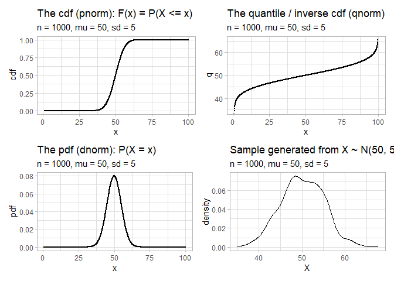
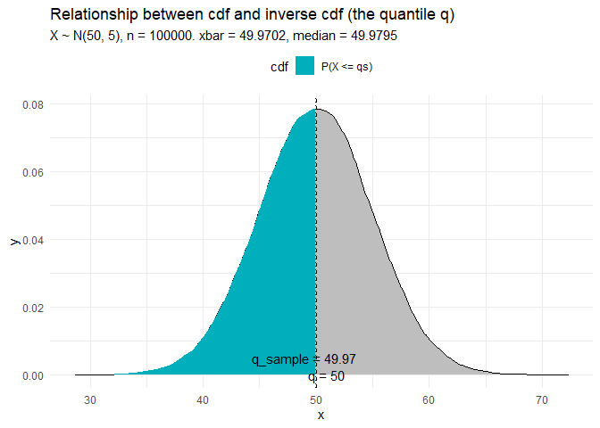

Emil Westin

# Probability distributions in R

| Distribution                   | cdf $F(x) = P(X \leq x)$ | Inverse cdf/quantile $F^{-1}(p) = x$ | pdf $f(x) = P(X = x)$ | Generate a random variable |
|--------------------------------|--------------------------|--------------------------------------|-----------------------|----------------------------|
| Beta                           | `pbeta`                  | `qbeta`                              | `dbeta`               | `rbeta`                    |
| Binomial                       | `pbinom`                 | `qbinom`                             | `dbinom`              | `rbinom`                   |
| Chi-Square                     | `pchisq`                 | `qchisq`                             | `dchisq`              | `rchisq`                   |
| Discrete Uniform               | `extraDistr::pdunif`     | `extraDistr::qdunif`                 | `extraDistr::ddunif`  | `extraDistr::rdunif`       |
| Exponential                    | `pexp`                   | `qexp`                               | `dexp`                | `rexp`                     |
| F                              | `pf`                     | `qf`                                 | `df`                  | `rf`                       |
| Gamma                          | `pgamma`                 | `qgamma`                             | `dgamma`              | `rgamma`                   |
| Geometric                      | `pgeom`                  | `qgeom`                              | `dgeom`               | `rgeom`                    |
| Logistic                       | `plogis`                 | `qlogis`                             | `dlogis`              | `rlogis`                   |
| Log Normal                     | `plnorm`                 | `plnorm`                             | `dlnorm`              | `rlnorm`                   |
| Negative Binomial              | `pnbinom`                | `qnbinom`                            | `dnbinom`             | `rnbinom`                  |
| Normal                         | `pnorm`                  | `qnorm`                              | `dnorm`               | `rnorm`                    |
| Poisson                        | `ppois`                  | `qpois`                              | `dpois`               | `rpois`                    |
| Student t                      | `pt`                     | `qt`                                 | `dt`                  | `rt`                       |
| Studentized Range              | `ptukey`                 | `qtukey`                             | \-                    | \-                         |
| Uniform                        | `punif`                  | `qunif`                              | `dunif`               | `runif`                    |
| Weibull                        | `pweibull`               | `qweibull`                           | `dweibull`            | `rweibull`                 |
| Wilcoxon Rank Sum Statistic    | `pwilcox`                | `qwilcox`                            | `dwilcox`             | `rwilcox`                  |
| Wilcoxon Signed Rank Statistic | `psignrank`              | `qsignrank`                          | `dsignrank`           | `rsignrank`                |

For more distributions not included in base R, see the package
`extraDistr` .

## The Normal Distribution

``` r
library(tidyverse)
library(patchwork)
options(scipen = 999)

mu <- 50
sd <- 5
n <- 1000
set.seed(10)
df <- tibble(
  x = seq(1, 100, length.out = n),
  p = seq(0, 1, length.out = n),
  pdf = dnorm(x, mean = mu, sd = sd), # f(x) = P(X = x)
  cdf = pnorm(x, mean = mu, sd = sd), # F(x) = P(X <= x)
  q = qnorm(p, mean = mu, sd = sd), # F^{-1}(p) = x
  X = rnorm(n, mean = mu, sd = sd) # generate a random variable
)

p_pdf <- df %>%
  ggplot(aes(x = x, y = pdf)) +
  geom_point(size = 0.5) +
  theme_light() +
  labs(
    title = "The pdf (dnorm): P(X = x)",
    subtitle = str_glue("n = {nrow(df)}, mu = {mu}, sd = {sd}")
  )
p_cdf <- df %>%
  ggplot(aes(x = x, y = cdf)) +
  geom_point(size = 0.5) +
  theme_light() +
  labs(
    title = "The cdf (pnorm): F(x) = P(X <= x)",
    subtitle = str_glue("n = {nrow(df)}, mu = {mu}, sd = {sd}")
  )
p_q <- df %>%
  ggplot(aes(x = x, y = q)) +
  geom_point(size = 0.5) +
  theme_light() +
  labs(
    title = "The quantile / inverse cdf (qnorm)",
    subtitle = str_glue("n = {nrow(df)}, mu = {mu}, sd = {sd}")
  )
p_X <- df %>%
  ggplot(aes(x = X)) +
  geom_density() +
  theme_light() +
  labs(
    title = "Sample generated from X ~ N(50, 5)",
    subtitle = str_glue("n = {nrow(df)}, mu = {mu}, sd = {sd}")
  )

(p_cdf + p_q )/
 ( p_pdf + p_X)
```



### Relationships between cdf and inverse cdf, quantiles and sample quantiles

The cdf and the inverse cdf are related by

$p = F(x), 0 \leq p \leq 1$

$x = F^{-1}(p)$

I.e. given a number (probability) between 0 and 1, return the p-th
quantile, i.e. the x-value on the plot. Consider also the difference
between the ‘theoretical’ quantile of the population (q) compared to the
observed sample quantile (qs).

``` r
options(scipen = 999)

plotnn <- function(n, mu, sd) {
  set.seed(10)
  X <- rnorm(n, mu, sd) # Generate random variable
  p <- 0.5 # Let the probability be 50% (the 50th percentile)
  q <- qnorm(p, mu, sd) # inverse cdf, theoretical quantile
  cdf <- pnorm(q, mu, sd) # cdf should be equal to p
  
  xbar <- mean(X) # sample mean
  xmedian <- median(X) # sample median
  sd(X)
  q_sample <- qnorm(p, xbar, sd(X)) %>% round(3)
  0.5 == pnorm(q_sample, xbar, sd(X)) # TRUE
  
  
  plot1 <- X %>%
    enframe() %>%
    ggplot(aes(x = value)) +
    geom_density(fill = "gray") +
    theme_minimal()+
    theme(legend.position="top")
  
  
  # extract x,y values from plot in order to shade the area
  d <- ggplot_build(plot1)$data[[1]]
  d <- d %>% mutate(color = case_when(
    x <= q & x > q_sample~ "P(X <= q)",
    x <= q_sample ~ "P(X <= qs)"
  ))
  
  plot1 +
    geom_area(data = subset(d, x <= q), aes(
      x = x, y = y,
      fill = factor(color)
    )) +
    annotate("text", x = q + 1, y = 0, label = str_glue("q = {q}")) +
    annotate("text", x = q - 1, y = 0 + 0.005, label = str_glue("q_sample = {q_sample}")) +
    geom_vline(xintercept = q, linetype = "dashed") +
    geom_vline(xintercept = q_sample, linetype = "dotted") + 
    scale_color_discrete("cdf:") +
    labs(
      title = "Relationship between cdf and inverse cdf (the quantile q)",
      subtitle = str_glue("X ~ N({mu}, {sd}), n = {n}. xbar = {round(xbar,4)}, median = {round(xmedian,4)}"),
      x = "x",
      fill = "cdf"
    ) +
    scale_fill_manual(breaks = c("P(X <= q)", "P(X <= qs)"),
                       values = c("#FC4E07","#00AFBB"))
}

mu <- 50
sd <- 5

plotnn(10, mu, sd)
```


``` r
plotnn(100, mu, sd)
```


``` r
plotnn(1000, mu, sd)
```


``` r
plotnn(100000, mu, sd)
```



Here is a QQ-plot to illustrate the observed quantiles (y-axis) vs the
theoretical quantiles (x-axis). This can be used to assess normality.
Note that the plot looks the same even if the values are z-transformed
or not (verify it yourself if you like by changing
`ggplot(aes(x = qq, y = x))` to `ggplot(aes(x = qq, y = x_scaled))`).

``` r
mu <- 50
sd <- 5

plotqq <- function(n, mu, sd) {
  set.seed(10)
  
  X <- rnorm(n, mu, sd)
  d <- X %>% 
    enframe(name = NULL, value = "x") %>% 
    mutate(across(x, scale, .names = "{.col}_scaled")) %>% # z-transform to mean zero and unit variance
    arrange(x) %>% 
    mutate(j = 1:length(X),
           prob_level = (j-0.5)/length(X), # 0.5 is the 'continuity' correction
           qq = qnorm(prob_level) # standard normal quantile,
    )
  
  d %>% 
    ggplot(aes(x = qq, y = x)) +
    geom_point() +
    geom_smooth(method = "lm", formula = y ~ x, se = FALSE) +
    labs(y = "Observed quantiles",
         x = "Theoretical quantiles",
         subtitle = str_glue("n = {n}, mu = {mu}, sd = {sd}")) +
    theme_light() 
}

p1 <- plotqq(10,mu,sd)
p2 <- plotqq(100,mu,sd)
p3 <- plotqq(1000,mu,sd)
p4 <- plotqq(100000,mu,sd)

(p1+p2) /
  (p3+p4)
```


## The difference between percentile, quantile and quartile

The table below shows a set of possible values (domains) for the
quantile(x) and percentile(x) functions, while the quartile is always
between 0-4.

| Quartile | Quantile | Percentile  |
|----------|----------|-------------|
| 0        | 0        | 0           |
| 1        | 0.25     | 25          |
| 2        | 0.5      | 50 (median) |
| 3        | 0.75     | 75          |
| 4        | 1        | 100         |

This does not say that a quantile varies between 0 and 1, and percentile
between 0 and 100. Quantiles can go from anything to anything.
[Link](https://stats.stackexchange.com/questions/156778/percentile-vs-quantile-vs-quartile "Percentile vs quantile vs quartile")

Also note that for samples from the normal distribution, the median may
not equal the sample quantile but they should not be far apart.

## Sample variance

The sample variance can be expressed in many ways, here are the two most
common ways:

$$
\begin{align}
s^2 &= \frac{1}{n-1} \sum_i^n (y_i-\bar{y})^2 \\
&= \frac{1}{n-1} (\sum_i^n y_i^2 - \frac{1}{n} (\sum_i^n y_i)^2)
\end{align}
$$

Proof:

$$
\begin{align}
s^2 &= \frac{1}{n-1} \sum_i^n (y_i-\bar{y})^2 \\
&= \frac{1}{n-1} \sum_i^n(y_i^2 - 2 y_i \bar{y} + \bar{y}^2) \\
&=  \frac{1}{n-1} (\sum_i^n y_i^2 - 2 \bar{y} \sum_i^n y_i + n\bar{y}^2) \\
&= \frac{1}{n-1} (\sum_i^n y_i^2 - 2 \frac{1}{n} (\sum_i^n y_i)^2 + \frac{1}{n} (\sum_i^n y_i) ^2) \\
&= \frac{1}{n-1} (\sum_i^n y_i^2 - \frac{1}{n} (\sum_i^n y_i)^2)
\end{align}
$$

Where

$$
\begin{align}
\bar{y} &=  \frac{1}{n} \sum_i^n y_i \\
\sum_i^n\bar{y} &= n\bar{y} = \sum_i^n y_i \\
\bar{y}^2 &=  \frac{1}{n^2} (\sum_i^n y_i)^2 \\
n\bar{y}^2 &= \frac{1}{n} (\sum_i^n y_i)^2
\end{align}
$$
